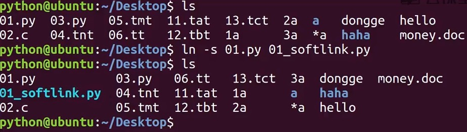

# Linux(Ubuntu) 操作-day1
***
## 1 Linux 目录
* / 根目录
* /bin、/usr/bin: 可执行二进制文件的目录，如常用的命令ls、tar、mv、cat等。
* /boot: 放置linux 系统启用时用到的一些文件，如Linux内核文件: /boot/vmlinuz，系统引导管理器: /boot/grub
* /etc: 系统配置文件存放的目录，不建议在此目录下存放可执行文件，重要的配置文件有/etc/inittab 、/etc/fatab、/etc/init.d、/etc/sysconfig、/etc/X11、/etc/xinetd.d。
* /home: 系统默认的用户家目录，新增用户账号时，用户家目录都存放在此目录下，~表示当前用户的家目录，~edu表示edu用户的家目录。
* /lib、/usr/lib、/usr/local/lib: 系统使用的函数库的目录，程序在执行过程中，需要调用一些额外的参数时需要函数库的协助。
* /lost+found: 系统异常产生错误时，会将一些遗失的片段放置于此目录下。
* /mnt: /media: 光盘默认挂载点，通常将光盘挂载于/mnt/cdrom下，也不一定，可以选择任意位置进行挂载。
* /opt: 给主机额外安装软件所摆放的目录。
* /proc: 此目录的数据都在内存中，比如系统核心，外部设备，网络状态，由于数据都存放在内存中，所以不占用磁盘空间，比较重要的目录有/proc/cpuinfo、/proc/interrupts、/proc/dma、/procc/ioports、/proc/net/* 等。
* /root: 系统管理员root的家目录。
* /sbin、/usr/sbin、/usr/local/sbin: 放置系统管理员使用的可执行命令，如fdisk,shutdown,mount等。与/bin不同的是，这几个目录是给系统管理员root使用的命令，一般用户只能"查看”而不能设置和使用。
* /tmp: 一般用户或正在执行的程序临时存放文件的目录，任何人可以访问，重要数据不可放置在此目录下。
* /srv: 服务启动后需要访问的数据目录。如WWW服务需要访问的网页数据存放在/srv/www内。
* /usr: 应用程序存放目录，/usr/bin存放应用程序，/usr/share 存放共享数据, /usr/lib存放不能直接运行的，却是许多程序运行所必须的一些函数文件。/usr/local 存放软件升级包。/usr/share/doc:系统说明文件存放目录。/usr/share/man: 程序说明文件存放目录。
* /var: 放置系统执行过程中经常变化的文件，如随时更改的日志文件/var/log,/var/log/message;所有的登录文件存放目录，/var/spool/mail: 邮件存放的目录， /var/run: 程序或服务启动后，起PID存放在改目录下。

### 1.1 用户目录
位于/home/user，称之为用户工作目录或家目录，表达方式：
  /home/user
  ~

### 1.2 相对路径和绝对路径
#### 绝对路径
从/目录开始描述的路径为绝对路径，如：
  cd /home/user
  ls /usr

#### 相对路径
从当前位置开始描述的路径为相对路径，如：
  cd ../../
  ls abc/def

### 1.3 命令格式
Linux 命令格式：
  command [-options] [parameter1] ...
ls:
  * ls: 查看当前路径下的文件以及文件夹名称
  * ls /usr 表示查看根目录下的usr文件夹下的文件
  * ls -a 显示当前路径隐藏文件
  * ls -l 以列表形式显示当前路径文件详细信息，大小，修改时间，权限，用户，用户组等信息
  * ls -l -h 显示文件单位为合适的单位
  * ls -alh 合并以上所有功能
  * ls *: 
    * "*” 表示任意多个字符，也可以没有
    * "?" 表示一个字符，一定有一个，不能没有  
cd:  
  * cd: Desktop 进入到Desktop这个文件夹
  * cd .. 返回当前目录的上一级目录
  * cd - 跳转到上一次所在路径  
pwd: 显示当前操作的绝对路径  
clear: 清屏  
.. 表示当前路径的上一层  
touch：  
  * touch 1.txt 创建一个1.txt文件
  * touch money 创建一个文件名为money的文件
  
Linux 文件
图中列出的信息含义如下图所示：  

与Dos下的文件操作类似，在Unix/Linux 系统中也允许使用特殊字符来同时引用多个文件名，这些特殊字符被称为通配符。
| 通配符 | 含义 |
| :---- | :---- |
| * | 文件代表文件名中所有字符 |
| ls te* | 查找以te开头的文件 |
| ls *html | 查找结尾为html的文件 |
| ? | 代表文件名中任意一个字符 |
| ls ?.c | 只找第一个字符任意，后缀为.c的文件 |
| ls a.? | 只找只有3个字符，前两个字符为a，最后一个字符任意的文件 |
| [] | ["和"]将字符组括起来，表示可以匹配字符组中的任意一个。"-"用于表示字符范围 |
| [abc] | 匹配a、b、c中任意一个 |
| [a-f] | 匹配从a到f范围内的任意一个字符 |
| ls [a-f]* | 找到从a到f范围内的任意一个字符开头的文件 |
| ls a-f | 查找文件名为a-f的文件，当"-"处于方括号之外则失去通配符的作用 |
| \ | 如果要用通配符作为普通字符使用，可以在其前面加上转义字符。"?"和"*"处于方括号内时不用使用转义字符就失去通配符的作用。 |
| ls \*a | 查找文件名为*a的文件 |

### 1.4 输出重定向命令: >
Linux 允许将命令执行结果重定向到一个文件，本应显示在终端上的内容保存到指定的文件中。
如：ls > test.txt （如果test.txt  不存在，则创建，存在则覆盖其内容）

### 1.5 分屏显示: more
  more test.txt 
一个屏幕显示不了完整的内容的时候，可以使用more这个命令分屏显示所有的内容。

### 1.6 管道命令: |
管道： 一个命令的输出可以通过管道作为另一个命令的输入。
管道我们可以理解现实生活中的管子，管子一头塞东西进去，另一头取出来，这里"|"的左右分为两端，左端塞东西(写)，右端取东西(读)。
  ls -alh > text.txt | more

### 1.7 清屏：clear

### 1.8 创建目录: mkdir
mkdir：
* mkdir abc 创建一个名称为abc的文件夹
* mkdir -p a/b/c/ 创建a文件夹，再在a文件夹中创建b文件夹，接着在b文件夹中创建c文件夹

### 1.9 删除目录: rmdir
可使用rmdir 命令删除一个目录。必须离开目录，并且目录必须为空目录，不然提示删除失败。  

### 1.10 删除文件: rm
可通过rm删除文件或目录。使用rm命令要小心，因为文件删除后不能恢复。为了防止文件误删，可以在rm后使用-i参数以逐个确认要删除的文件。  

常用参数以及含义如下表所示：  
| 参数 | 含义 |
|:----:|:----:|
| -i | 以进行交互式方式执行 |
| -f | 强制删除，忽略不存在的文件，无需提示 |
| -r | 递归删除目录下的内容，删除文件夹时必须加此参数 |

### 1.11 建立连接文件： ln
Linux 链接文件类似于Windows下的快捷方式。  
链接文件分为软链接和硬链接。  
软链接：软链接不占用磁盘空间，源文件删除则软链接失效。  
硬链接：硬链接只能链接普通文件，不能链接目录。  
使用格式：  
  ln 源文件 链接文件
  ln -s 源文件 链接文件

如果没有-s选项代表建立一个硬链接文件，两个文件占用相同大小的磁盘空间，即使删除了源文件，链接文件还是存在，所以-s选项是更常见的形式。

注意：如果软链接文件和源文件不在同一个目录，源文件要使用绝对路径，不能使用相对路径。  

可以ls查看软链接  

知识点：
* 修改硬连接会直接修改源文件
* ls -l可以看到源文件copy数量

***
有兴趣一起学习的可以加我微信，大家一起交流。加我请备注"13天Python学习”

