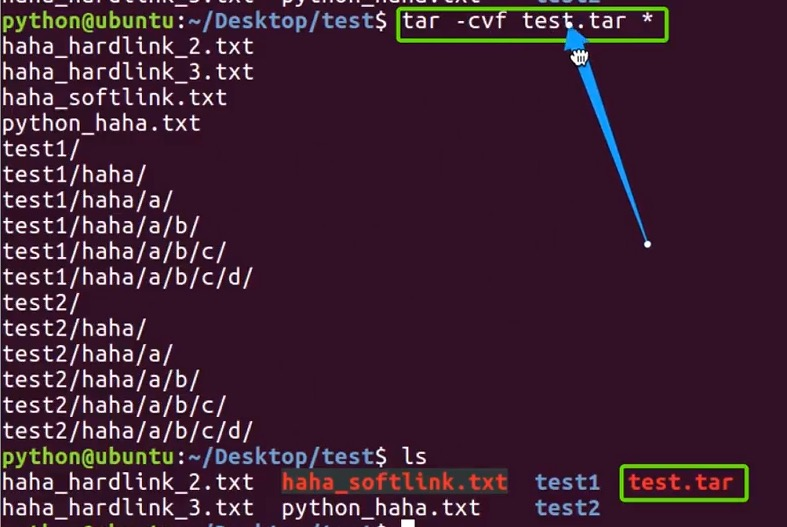
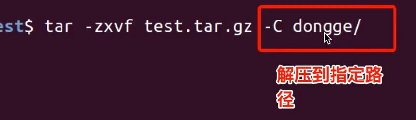
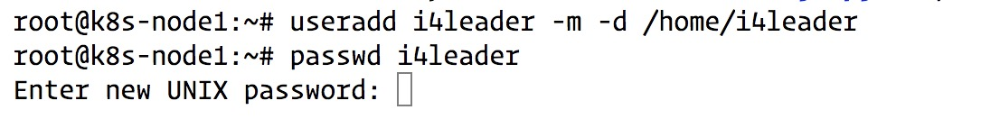
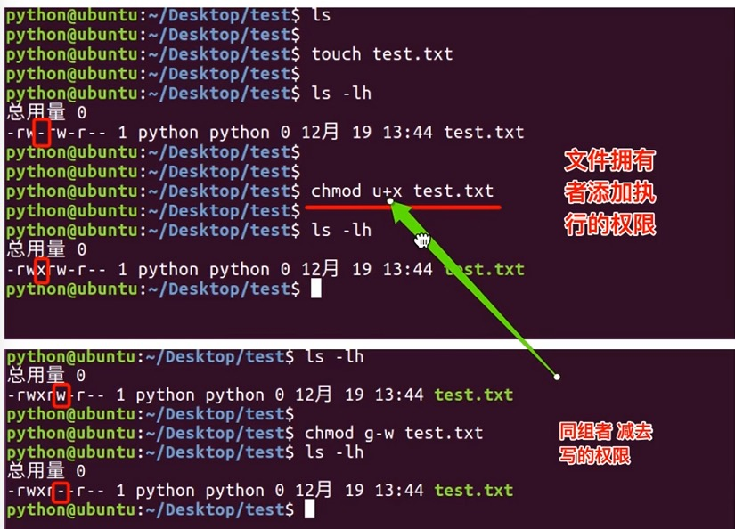

# Linux(Ubuntu) 操作-day2 
***
## 2.0 继续Linux 基本操作介绍

### 2.1 cat合并文件、grep查找文件内容

```
cat test.txt 
```
将test.txt中的内容显示出来
```
    cat test.txt test02.txt
```
先显示text.txt 中的内容再显示text02.txt中的内容
```
    cat test.txt test02.txt > text03.txt
```
将test.txt 和test02.txt中的内容合并到text03.txt 中。

grep 一般格式为：
```
grep [-选项] '搜索内容串'文件名
```
在grep命令中输入字符串参数时，最好引号或双引号括起来。例如: grep 'a' 1.txt
常用选项说明：
|选项|含义|
|:----|:----|
|-v|显示不包含匹配文本的所有行(相当于求反)|
|-n|显示匹配行以及行号|
|-i|忽略大小写|  

grep搜索内容串可以是正则表达式。
正则表达式是对字符串操作的一种逻辑公式，就是用事先定义好的一些特殊字符、以及这些特定字符的组合，组成一个”规则字符串"，这个"规则字符串”用来表达对字符串的一种过滤逻辑。

```
grep -n 'a' text.txt
```
将text.txt中的带a字母的行显示出来；-n 代表显示行号；如果去掉-n 则不会显示行号。
```
grep -n ’^a‘ text.txt
grep -n ’a$‘ text.txt
```
''中可以是正则表达式，^a表示以a开头的；a$表示以a结尾的
```
grep -n '[tT]' text.txt
```
表示显示任意带t或者T的行，满足一个条件就可以。


### 2.2 --help
```
ls --help
```
使用--help来查看命令帮助文件

### 2.3 man （有问题找男人）manual
man是linux 提供的命令帮助手册。
例如： man ls;


### 2.4 自动补全
tab键可以自动补全

### 2.5 history
命令history 可以显示刚才敲过的命令行

### 2.6 查找文件：find
find 命令功能非常强大，通常用来在特定的目录下搜索符合条件的文件，也可以用来搜索特定用户属主的文件。

常用用法：   
| 命令 | 含义 |
| :---- | :---- |
| find ./ -name test.sh | 查找当前目录下所有名为test.sh的文件|
| find ./ -name '*.sh' | 查找当前目录下所有后缀为.sh的文件|
| find ./ -name "[A-Z]*" | 查找当前目录下所有以大写字母开头的文件|
| find /tmp -size 2M | 查找在/tmp目录下等于2M的文件|
| find /tmp -size +2M | 查找在/tmp目录下大于2M的文件|
| find /tmp -size -2M | 查找在/tmp目录下小于2M的文件|
| find ./ size +4k -size -5M | 查找当前目录下大于4K，小于5M的文件|
| find ./ -perm 0777 | 查找当前目录下权限为777的文件或目录|  


### 2.7 拷贝文件:cp
cp命令的功能是将给出的文件或目录复制到另一个文件或目录中，相当于DOS下的copy命令。
常用选项说明：  
| 选项 | 含义 |
| :----| :---- |
|-a|该选项通常在复制目录时使用，它保留链接、文件属性、并递归地复制目录、简单、保持文件原有属性。|
|-f|已经存在的目标文件而不提示|
|-i|交互式复制，在覆盖目标文件之前将给出提示要求用户确认|
|-r|若给出的源文件是目录文件，则cp将递归复制目录下的所有子目录和文件，目标文件必须为一个目录名。|
|-v|显示拷贝进度|

```
cp a b *将a文件夹整体复制到b文件夹下*
cp a/* b *将a文件夹下的所有内容复制到b文件夹下*
```

### 2.8 移动、剪切、重命名：mv
用户可以使用mv命令来移动文件或者目录，也可以给文件或目录重命名。
常用选项说明：    
|选项|含义|
| :---- | :---- |
|-f|禁止交互式操作，如有覆盖也不会给出提示|
|-i|确认交互方式操作，如果mv操作将导致对已存在的目标文件的覆盖。系统会询问是否重写，要求用户回答以避免覆盖文件|
|-v|显示移动进度|  

```
mv a b  
```
将文件或者文件夹a重命名为b


### 2.9 压缩，归档文件： tar
计算机中的数据经常要备份，tar是Unix/Linux中最常用的备份工具，此命令可以把一系列文件归档到一个大文件中，也可以把档案文件解开以恢复数据。

tar使用格式 tar [参数] 打包文件名 文件

tar命令很特殊，其参数前面可以使用"-",也可以不使用。

常用参数：  
| 参数 | 含义 |
| :---- | :---- |
| -c | 生成档案文件，创建打包文件 |
| -v | 列出归档解档的详细过程，显示进度 |
| -f | 指定档案文件名称，f后面一定是.tar文件，所以必须放选项最后 |
| -t | 列出档案中包含的文件 |
| -x | 解开档案文件 |  

注意： 除了f需要放在参数的最后，其他参数顺序任意。

```
tar -cvf test.tar *
```
将当前目录所有文件都打包到test.tar 中  


```
gzip xxx.tar
```
压缩文件  
```
gzip -d xxx.tar.gz
```
解压缩文件  
```
tar -zcvf xxx.tar.gz *
```
将当前路径下的所有文件夹打包并压缩到xxx.tar.gz文件中  
```
tar -zxvf xxx.tar.gz 
```
将当前路径下xxx.tar.gz文件解压到当前目录
```
tar -zxvf xxx.tar.gz -C /tmp
```
将当前路径下xxx.tar.gz文件解压到/tmp目录  


### 2.10 文件压缩解压： bzip2
tar与bzip2命令结合使用实现文件打包、压缩（用法和gzip一样）。  
tar 只负责打包文件，但不压缩，用bzip2压缩tar打包后的文件，其扩展名一般用xxxx.tar.gz2。  
用tar命令中增加一个选项(-j)可以调用bzip2实现了一个压缩的功能，实行一个先打包后压缩的过程。  
压缩用法：tar -jcvf 压缩包名称 文件...(tar jcvf xxx.tar.bz2 *.c)
解压用法: tar -jxvf 压缩包名称 (tar jxvf xxx.tar.bz2)  

### 2.11  文件压缩、解压：zip、unzip
通过zip压缩文件的目标文件不需要指定扩展名，默认扩展名为zip.  
压缩文件：zip [-r] 目标文件(没有扩展名) 源文件  *有[]的意思是可选的意思*  
解压文件：unzip -d 解压后目录文件 压缩文件
```
zip xxx *
```
压缩所有文件到xxx文件中,压缩后的文件名为xxx.zip  
```
unzip -d ./tmp xxx.zip
```
将xxx.zip解压到/tmp 文件目录下.  
注意：如果解压过程中指定的路径不存在，则自动创建该路径。  

### 2.12 查看命令位置: which
```
which ls
```
显示ls文件路径为/bin目录  


## Linux 用户、权限管理
### 2.13 查看当前用户： whoami
whoami该命令用户查查看当前系统当前账号的用户名。可通过cat /etc/passwd 查看系统用户信息。  

### 2.14 查看登录用户：who
who命令用于查看当前所有登录系统的用户信息。
常用选项：  
|  选项   |  含义 |
|  :----  | :----  |
| -m或am I  | 只显示运行who命令的用户名、登录终端和登录时间 |
| -q或--count | 只显示用户的登录账号和登录用户的数量 |
| -u或--heading | 显示列标题 |

### 2.15 退出登录账户： exit
如果是图形界面，退出当前终端；  
如果是使用ssh远程登录，退出登录账户；  
如果是切换后的登录用户，退出则返回上一个登录账号。

### 2.16 添加用户账号： useradd
在Unix/Linux中添加用户账号可以使用adduser或useradd命令，因为adduser命令是指向useradd命令的一个连接诶，因此，这两个命令的使用格式完全一样。  
Useradd命令的使用格式如下： useradd [参数] 新建用户账号  
|  参数   | 含义  |
|  :----  | :----  |
| -d  | 指定用户登录系统时的主目录，如果不使用该参数，系统自动在/home目录下建立与用户名同名目录为主目录 |
| -m  | 自动建立目录 |
| -g  | 指定组名称 |

相关说明：
* Linux每个用户都要有一个主目录，主目录就是第一次登录系统，用户的默认当前目录(/home/用户)；
* 每一个用户必须有一个主目录，所以用useradd创建用户的时候，一定给用户指定一个主目录；
* 用户的主目录一般要放到根目录的home目录下，用户的主目录和用户名是相同的；
* 如果创建用户的时候，不指定组名，那么系统会自动创建一个和用户名一样的组名。
  
|  命令   | 含义  |
|  :----  | :----  |
| useradd -d /home/abc abc -m  | 创建abc用户，如果/home/abc目录不存在，就自动创建这个目录，同时用户属于abc组 |
| useradd -d /home/a a -g test -m  | 创建一个用户名叫a，主目录在/home/a,如果主目录不存在，就自动创建主目录，同时用户属于test组 |
| cat /etc/passwd | 查看系统当前用户名 |  

  

### 2.17 修改密码： passwd
使用方法： passwd root
意思就是修改用户root的密码

### 2.18 切换用户： su
可以通过su命令切换用户，su后面可以加"-"。su 和su -命令不同之处在于，su-切换到对应的用户时会将当前的工作目录自动转换到切换后的用户主目录：  
sudo -s 直接切换到root账户
sudo su 直接切换到root账户
su root 切换到root账户

### 2.19 删除用户： userdel
|  命令   | 含义  |
|  :----  | :----  |
| userdel abc(用户名)  | 删除abc用户，但不会自动删除用户的主目录 |
| userdel -r abc（用户名）  | 删除用户，同时删除用户主目录以及组信息(可以使用 groupmod 看组信息) |

### 2.20 查看有哪些用户组
* 方法：
```
cat /etc/group
```
### 2.21 添加删除用户组
使用方法： groupadd xxx  
添加xxx组
使用方法：groupdel xxx  
删除xxx组

### 2.22 修改用户所在组： usermod
使用方法： usermod -g  test i4leader  
把i4leader这个用户改到test组中去  
新创建的用户，默认不能sudo，需要进行一下操作：
```
sudo usermod -a -G adm 用户名
sudo usermod -a -G sudo 用户名
```
将用户加入到adm以及sudo组就可以运行sudo了。  

**-g**用来制定这个用户默认的用户组
**-G**一般配合'-a'来完成向其他组添加

### 2.23 查看用户在哪些组
使用方法： groups i4leader  
查看i4leader这个用户在哪个组

### 2.24 修改文件权限：chmod
chmod修改文件权限有两种格式：字母法与数字法。
字母法：chmod u/g/o/a +/-/=rwx 文件  
|  [u/g/o/a]   | 含义  |
|  :----  | :----  |
| u  | user表示该文件所有者 |
| g  | group表示该文件的所有者属于同一组(group)者，即用户组 |
| o | other表示其他以外的人 |
| a | all表示这三者皆是 |

|  +-=   | 含义  |
|  :----  | :----  |
| +  | 增加权限 |
| -  | 撤销权限 |
| =  | 设定权限 |

文件夹权限drwxrwxr-x解析：
* 第一个d表示directory目录
* r表示读---->对应的数字是4
* w表示写---->对应的数字是2
* x表示执行---->对应的数字是1
* 前三位为用户权限
* 中间三位为同组者权限
* 后三位为其他人的权限
示例：  
```
chmod u=rw,g=x,o=r xxx.txt  ===> chmod 614
chmod o+x xxx.txt           ===> chmod 001
chmod u=rwx a.txt           ===> chmod 700
chmod a=rwx b.txt           ===> chmod 777
chmod a= c.txt              ===> chmod 000
```


重点：chmod 666 123 -R  
可以对文件夹以及文件夹内部的文件递归修改权限。

### 2.25 修改文件所有者：chown
使用方法： sudo chown i4leader text.txt  
表示将text.txt文件的所有者修改为i4leader

### 2.26 修改文件所属组
使用方法： sudo chgrp i4leader text.txt 
表示将text.txt文件的组修改为i4leader

***
有兴趣一起学习的可以加我微信，大家一起交流。加我请备注"13天Python学习”
