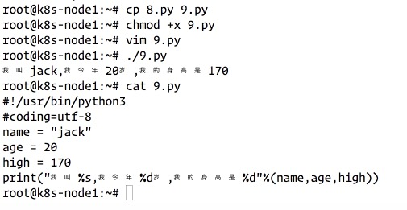

# 1. Python 
## 1.1 认识Python
1991年诞生
人生苦短，我用Python

* 优点
  * 简单
  * 易学
  * 免费、开源
  * 高层语言
  * 可移植性
  * 解释性
  * 丰富的库
  * 规范的代码
* 缺点
  * 运行速度
  * 国内市场小
  * 中文资料匮乏
  * 框架选择太多
* Python应用场景
  * web应用开发-mod_wsgi模块
  * 操作系统管理、服务器运维的自动化脚本
  * 科学计算
  * 桌面软件-pyQi、PySide、wxPython、PyGTK是开发桌面应用程序的利器。
  * 服务器软件（网络软件）
  * 游戏
  * 构思实现，产品早期原型和迭代


## 1.2 第一个Python程序
1. 打开超级终端；  
2. 输入python3或者python；  
3. 运行print("Hello World")  
   
发现除了print一些字符之外python还能执行一些数学计算。  

iPython是交互式的python。  

python 和 python3的区别：  
* Python3 可以补全命令；  

* 在代码第一行写入执行时的Python解释器路径，编辑完后需要对此python文件添加‘x'权限  
```
#!/usr/bin/python3
#coding=utf-8  
#该行必须放在顶端，也不能加空格
print("hello world!")
```
写出来的程序保存为1.py；需要手动运行命令chmod +x 1.py加执行权限之后才能使用./1.py来直接运行。   


## 1.3 注释
可以使用"#"来给代码注释该段代码的意思： 
* 单行注释
* 多行注释
* 文本注释

## 1.4 变量以及类型
1. 变量的定义
在python中如果需要存储一个数据，则需要使用变量的概念：  
名字 = 值  

```
a = 100
b = 200
c = a + b
print("c”)
```

print("c”) 加上""之后输出是c；去掉""之后输出300.   


2. 变量类型
   * number:
     * int ---整数类型
     * long ---长整型[也可以代表八进制和十六进制]
     * float ---浮点型
     * complex ---复数
   * 布尔类型
     * true
     * false
   * string --- 字符型
   * List --- 列表
   * Tuple --- 元祖
   * Dictionary --- 字典
如何判断字符类型：   
* 示例代码：
```
#!/usr/bin/python3
#coding=utf-8
print("hello world!")
name = "jack"
age = 20
a = 100
b = 200
c = a + b
print(c)
print(type(age))
print(type(name))
```
* 输出结果如下,可以看到通过type()可以自动识别变量类型：   


注意点：   
***Print函数建议加括号()；如果不加括号，python3无法识别。***

## 1.5 标识符和关键字
标示符：开发人员在程序中自定义的一些符号和名称。   
标示符由字母、下划线和数字组成；只允许字母或者_开头；数字不允许开头。   
**python标示符中区分大小写**
### 命名规则
* 见名知意
* 驼峰命名法---如：userName,userLoginVar,myCar

### 关键字
python一些具有特殊功能的标示符，这就是所谓的关键字；   
关键字，是python已经在使用的了，所以不允许开发者自己定义相同名字的标示符。   
可以使用如下方法导出系统默认关键字列表：   
1. 使用ipython3输入import keyword；
2. 然后再输入keyword.kwlist可以print所有的默认关键字。
```
'False',
 'None',
 'True',
 'and',
 'as',
 'assert',
 'break',
 'class',
 'continue',
 'def',
 'del',
 'elif',
 'else',
 'except',
 'finally',
 'for',
 'from',
 'global',
 'if',
 'import',
 'in',
 'is',
 'lambda',
 'nonlocal',
 'not',
 'or',
 'pass',
 'raise',
 'return',
 'try',
 'while',
 'with',
 'yield'
```

## 1.6 输出
格式化输出
```
\n  表示换行
\t  表示tab键
+   可以把变量加一起显示
```
#### 示例1：普通输出演示   
```
root@k8s-node1:~# cat 6.py 
#output

print("name:xiaotu")
print("联系方式:181*********")
print("地址:南京*****")
root@k8s-node1:~# python3 6.py 
name:xiaotu
联系方式:181*********
地址:南京*****
root@k8s-node1:~# vim 6.py 
root@k8s-node1:~# cat 6.py 
#output

print("name:\nxiaotu")
print("联系方式:\t181*********")
print("地址:南京*****")
root@k8s-node1:~# python3 6.py 
name:
xiaotu
联系方式:       181*********
地址:南京*****
```
#### 示例2：换行显示以及加号的用法演示   
```
root@k8s-node1:~# cat 6.py 
#output
name = "xiaotu"
phone = 181
address = "nanjing"
print("name:\nxiaotu")
print("联系方式:\t181*********")
print("地址:南京*****")
print(name+address)
root@k8s-node1:~# python3 6.py 
name:
xiaotu
联系方式:       181*********
地址:南京*****
xiaotunanjing
root@k8s-node1:~# 
```
#### 示例3：格式化输出演示   
```
root@k8s-node1:~# chmod +x 7.py 
root@k8s-node1:~# ./7.py 
我今年20岁
root@k8s-node1:~# cat 7.py 
#!/usr/bin/python3
#coding=utf-8
age = 20
print("我今年%d岁"%age)
```



### 常用的格式符号 
下面是完整的，它可以与%符号使用列表：   
|  格式符号   | 转换  |
|  ----  | ----  |
| %c  | 字符 |
| %s  | 通过str()字符串转换来格式化 |
| %i  | 有符号十进制整数  |
| %d  | 有符号十进制整数  |
| %u  | 无符号十进制整数  |
| %o  | 八进制整数  |
| %x  | 十六进制整数(小写字母)  |
| %X  | 十六进制整数(大写字母)  |
| %e  | 索引符号(小写’e')  |
| %E  | 索引符号(大写"E")  |
| %f  | 浮点实数  |
| %g  | %f和%e的简写  |
| %G  | %f和%E的简写

#### 示例4：两次print显示在一行中
```
root@k8s-node1:~# cat 6.py 
#output
#怎么显示在一行中?
print("aaaaaaa")
print("bbbbbbb")
print("aaaaaaa",end="")
print("bbbbbbb")
root@k8s-node1:~# chmod +x 6.py 
root@k8s-node1:~# python3 6.py 
aaaaaaa
bbbbbbb
aaaaaaabbbbbbb
```
看了print的默认命令说明之后发现默认print的命令结尾是换行；手动可以修改end的默认行为。   

## 1.7 输入
输入:    
input()

#### 示例1：   
```
input("请输入用户名:”)
```

#### 示例2：   
```
userName = input("请输入用户名:”)
print("你刚刚输入的用户名是:%s"%userName)
```


#### 示例3：
只要input的内容都是字符串。   
```
# 提示并获取手机号码
phoneNum = input("请输入您的手机号码：")
print("您输入的手机号码为:%s"%phoneNum)

```
测试结果：   
```
root@k8s-node1:~# cat b.py 
phoneNum = input("请输入您的手机号码：")
print("您输入的手机号码为:%s"%phoneNum)
root@k8s-node1:~# python3 b.py 
请输入您的手机号码：18100001111
您输入的手机号码为:18100001111
```

### raw_input()函数和input()的区别
代码解释一切：   
   
python2中的raw_input()其实就是python3中的input().   

## 1.8 运算符
python 支持以下几种运算符
* 算术运算符
下面以a=10，b=20为例进行运算：   
|  运算符   | 描述  | 实例 |
|  :----  | :----  | :----  |
| +  | 加 | 两个对象相加 a+b 输出结果30 |
| -  | 减 | 得到负数或是一个数减去另一个数a-b输出结果-10 |
| *  | 乘 | 两个数相乘或是返回一个被重复若干次的字符串a*b输出结果200 |
| /  | 除 | x除以y b/a输出结果2 |
| //  | 取整数 | 返回商的整数部分9//2输出结果4，9.0/2.0输出结果4.0 |
| %  | 取余 | 返回除法的余数 b % a 输出结果0 |
| **  | 幂 | 返回x的y次幂 a**b 为10的20次方，输出结果 |


运算不管有多少嵌套，只能使用括号()，不能使用中括号或者大括号。   

运算不一定非要是数字。   


* 赋值运算符 --> 其实就是一个等号"="表示赋值；把等号右边的东西给左边变量。并且如果右边有运算的话，会先计算出结果并将运算结果进行赋值。
```
A,B = B,A
```
AB两个变量值进行变换。

* 复合赋值运算符
|  运算符   | 描述  | 实例  |
|  :----  | :----  | :----  |
| +=  | 加法赋值运算符 | c += a 等效于c = c + a |
| -=  | 减法赋值运算符 | c -= a 等效于c = c - a |
| *=  | 乘法赋值运算符 | c *= a 等效于c = c * a | 
| /=  | 除法赋值运算符 | c /= a 等效于c = c / a |
| %=  | 取模赋值运算符 | c %= a 等效于c = c % a |
| \*\*= | 幂赋值运算符   | c \*\*= a等效于c = c\*\*a |
| //=  | 取整除赋值运算符 | c //= a 等效于 c = c // a |

## 1.9  数据类型转换
```
a = int("100") ---> 把字符串"100"变成整数100   
```
a的值为100（整数）

## 1.10 判断语句介绍


## 1.11 if语句


## 1.12 比较、关系运算符


## 1.13 作业


## 1.14 附录-推荐的python电子书

***
有兴趣一起学习的可以加我微信，大家一起交流。加我请备注"13天Python学习”
