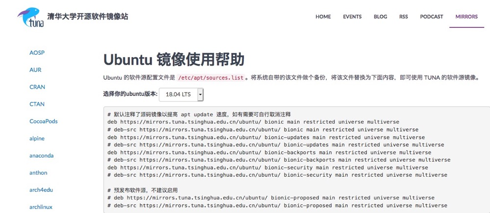

## Linux 系统命令
***
### 3.0 查看当前日历： cal
使用方法：
```
cal
cal -y
```

### 3.1 显示日期和时间： date
设置时间格式(需要管理员权限)：
```
date [MMDDhhmm[[CC]YY][.ss]] + format
```
CC为年前两位yy为年的后两位，前两位的mm为月，后两位的mm为分钟，dd为天，hh为小时，ss为秒。如： date010203042020.55

显示时间格式 (date '+%y,%m,%d,%H,%M,%S');
|  format格式   | 含义  |
|  :----  | :----  |
| %Y，%y  | 年 |
| %m  | 月 |
| %d  | 日  |
| %H  | 时  |
| %M  | 分  |
| %S  | 秒  |

### 3.2 查看进程信息： ps
进程是一个具有一定独立功能的程序，它是操作系统动态执行的基本单元。  
ps命令可以查看进程的详细状况，常用选项(选项可以不加"-")如下：
|  选项   | 含义  |
|  :----  | :----  |
| -a  | 显示终端上的所有进程，包括其他用户的进程 |
| -u  | 显示进程的详细状态 |
| -x  | 显示没有控制终端的进程 |
| -w  | 显示加宽，以便显示更多的信息 |
| -r  | 只显示正在运行的进程 |


### 3.3 动态显示进程：top
top命令用来动态显示运行中的进程。top命令能够在运行后，在指定的时间间隔显示信息。可以在使用top命令时加上-d来指定显示信息更新的时间间隔。  
在top命令执行后，可以按下按键得到对显示的结果进行排序：
|  按键   | 含义  |
|  :----  | :----  |
| M  | 根据内存使用量来排序 |
| P  | 根据cpu占有率来排序 |
| T  | 根据进程运行时间的长短来排序 |
| U  | 可以根据后面输入的用户名来筛选进程 |
| K  | 可以根据后面输入的PID来杀死进程 |
| q  | 退出 |
| h  | 获得帮助 |

### 3.4 终止进程： kill
kill 命令指定进程号的进程，需要配合ps使用。
使用格式：
```
kill [-signal] pid
```
信号值从0到15，其中9为绝对终止，可以处理一般信号无法终止的进程。  
kill 9133: 9133为应用程序所对应的进程号


### 3.5 关机重启： reboot、shutdown、init
|  命令   | 含义  |
|  :----  | :----  |
| reboot  | 重启操作系统 |
| shutdown -r now  | 重新启动操作系统,shutdown 会给别的用户提示 |
| shutdown -h now  | 立刻关机，其中now相当于时间为0的状态  |
| shutdown -h 20:25  | 系统在今天的20：25会关机  |
| shutdown -h +10  | 系统再过十分钟后自动关机  |
| init 0  | 关机  |
| init 6  | 重启  |

### 3.6 检测磁盘空间：df
df命令用于检测文件系统的磁盘空间占用和空余情况，可以显示所有文件系统对节点和磁盘块的使用情况。  
|  命令   | 含义  |
|  :----  | :----  |
| -a  | 显示所有文件系统的磁盘使用情况  |
| -m  | 以1024字节为单位显示  |
| -t  | 显示各指定文件系统的磁盘空间使用情况  |
| -T  | 显示文件系统  |

### 3.7 检测目录所占磁盘空间：du
du命令用于统计目录或文件所占磁盘空间的大小，该命令的执行结果与df类似，du更侧重于磁盘的使用状况。  
du命令的使用格式如下： du [选项] 目录或文件名  
|  命令   | 含义  |
|  :----  | :----  |
| -a  | 递归显示指定目录中各文件和子目录中文件占用的数据块  |
| -s  | 显示指定文件或目录占用的数据块  |
| -b  | 以字节为单位显示磁盘占用情况  |
| -l  | 计算所有文件大小，对硬链接文件计算多次  |

### 3.8 ifconfig & ping

### 3.9 vim 编辑器之神
vi有3中模式
命令模式：在该模式下是不能对文件直接编辑，可以输入快捷键（命令）进行一些操作（删除行，复制行，移动光标，粘贴等等）【打开文件之后默认进入的模式】；
编辑模式：在该模式下可以对文件的内容进行编辑；
末行模式：可以在末行输入命令来对文件进行操作（搜索、替换、保存、退出、撤销、高亮等等）；

从命令模式到编辑模式三种插入方式:
1. 小写a--> 在光标后面插入
2. 小写i--> 在光标前面插入
3. 小写o--> 在下一行插入
4. 大写I--> 在行首插入
5. 大写A--> 在行末插入
6. 大写O--> 在上一行插入

常用命令：
* 命令模式
  * hjkl    控制上下左右
  * M       中间位置
  * L       当前屏幕的最后一行
  * yy      复制，8yy：表示从当前光标所在的行开始复制8行
  * p       粘贴
  * dd      删除
  * 4dd     剪切（删除）包括光标所在的后4行
  * d0      从光标处删至行首
  * D       从光标处删至行末
  * x       向后删除一个字符
  * X       向前删除一个字符
  * 撤销命令
```
u       撤销操作
ctrl+r  反撤销
```
  * 定位命令
```
   H       移动光标至当前屏幕的上方
   M       移动光标至当前屏幕的中间
   L       移动光标至当前屏幕的下方
   ctrl+f  向下翻一页
   ctrl+b  向上翻一页
   ctrl+d  向下翻半页
   ctrl+u  向上翻半页
   {       光标向上移动一段代码
   }       光标向下移动一段代码
   G       定位光标至文件末尾
   20G     定位光标至第20行
   gg      定位光标至文件开始
   ^       定位光标到行首
   $       定位光标到行末
   w       光标向后移动一个单词长度
   b       光标向前移动一个单词长度
``` 
  * v       选中光标经过的代码
  * V       选中光标所在的行
  * <<      选中部分整体向左偏移
  * >>      选中部分整体向右偏移
  * .       重复上一次指令
  * r       替换一个字符
  * R       替换光标后面的若干字符
  
  

* 编辑模式
  * Esc 退出编辑模式到命令模式


* 末行模式
  * w   保存
  * q   退出
  * !   强制
  * wq  保存退出
  * q!  不保存退出
  * Esc 返回至命令模式
  * :%s/(目标内容)/(替换内容)/g 全局替换
  * /   搜索(n:跳转到下一个匹配的内容，N跳转到上一个匹配的内容)
  * shift+zz保存并且推出编辑
  * !加shell命令
  * 分屏
    * :sp newfile  上下分屏。则分出一个窗口编辑newfile文件。如果要从命令模式转换到编辑模式，可以键入命令a或者i；如果需要从文本模式返回，则按Esc键即可。在命令模式下输入“:”即可切换到末行模式，然后输入命令。
    * :vsp         左右分屏
    * ctrl+w+w     在多个窗口间切换
  
* 例子
  * vim 1.py +22  打开文件直接跳到22行
  * 1,10s/abc/123/g  将第一行到第十行之间的abc换成123 
  * vim -On file1 file2 ... 使用大写O参数进行垂直分屏
  * vim -on file1 file2 ... 使用小写o参数进行水平分屏

### Ubuntu配置下载源
```
vim /etc/apt/sources.list
```
国内常见软件源：  
https://mirrors.tuna.tsinghua.edu.cn/help/ubuntu  

在更改了软件源之后建议执行**apt-get update**来更新软件缓存。  
#### 更新软件包   
```
apt-get update                  // 更新安装源（Source）
apt-get upgrade                 // 更新已安装的软件包
apt-get dist-upgrade            // 更新已安装的软件包（识别并处理依赖关系的改变）
```
#### 安装软件包   
```
apt-get install PackageName                 // 普通安装
apt-get install PackageName=VersionName     // 安装指定包的指定版本
apt-get --reinstall install PackageName     // 重新安装

apt-get build-dep PackageName               // 安装源码包所需要的编译环境
apt-get -f install                          // 修复依赖关系

apt-get source PackageName                  // 下载软件包的源码
```
#### 卸载软件包   
```
apt-get remove PackageName              // 删除软件包, 保留配置文件

apt-get --purge remove PackageName      // 删除软件包, 同时删除配置文件
apt-get purge PackageName               // 删除软件包, 同时删除配置文件

apt-get autoremove PackageName          // 删除软件包, 同时删除为满足依赖
                                        // 而自动安装且不再使用的软件包

apt-get --purge autoremove PackageName  // 删除软件包, 删除配置文件, 
                                        // 删除不再使用的依赖包

apt-get clean && apt-get autoclean      // 清除 已下载的软件包 和 旧软件包
```
#### 查询软件包   
```
dpkg -l                             // 列出已安装的所有软件包

apt-cache search PackageName        // 搜索软件包
apt-cache show PackageName          // 获取软件包的相关信息, 如说明、大小、版本等

apt-cache depends PackageName       // 查看该软件包需要哪些依赖包
apt-cache rdepends PackageName      // 查看该软件包被哪些包依赖

apt-get check                       // 检查是否有损坏的依赖

```


***
有兴趣一起学习的可以加我微信，大家一起交流。加我请备注“13天Python学习”
