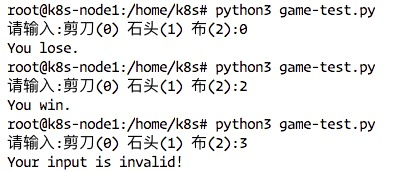
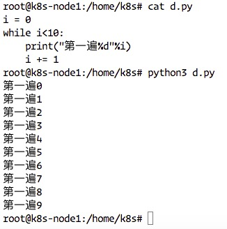
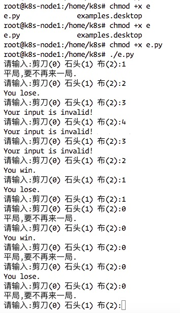
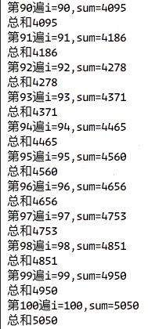
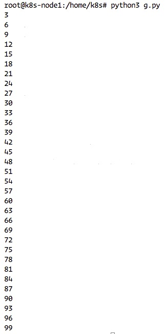

## Python 语法

### if 嵌套
使用方法：   
```
if xxxx:
   if yyyy:
   else xxxx
elif ssss:
   if dddd:
   else oooo:
else ssaa
```

#### 应用：猜拳游戏
*效果，和电脑进行猜拳游戏
代码：   
```
#!/usr/bin/python3
#coding:UTF-8
import random
#计算机赋值随机变量定义剪刀石头布
computerResult = random.choice([0,1,2])

#获取用户的剪刀石头布
userResult = int(input("请输入:剪刀(0) 石头(1) 布(2):"))

if userResult ==  0:
    if computerResult == 0:
        print("平局,要不再来一局.")
    elif computerResult == 1:
        print("You lose.")
    elif computerResult == 2:
        print("You win.")
elif userResult == 1:
    if computerResult == 1:
        print("平局,要不再来一局.")
    elif computerResult == 2:
        print("You lose.")
    elif computerResult == 1:
        print("You win.")
elif userResult == 2:
    if computerResult == 2:
        print("平局,要不再来一局.")
    elif computerResult == 1:
        print("You lose.")
    elif computerResult == 0:
        print("You win.")
else:
    print("Your input is invalid!")
```   

   

### 循环语句介绍
```
i = 0
while i<10:
    print("第一遍%d"%i)
    i += 1
```   
测试结果：   
   

### 小总结   
* 一般情况下，需要多次重复执行的代码，都可以用循环的方式来完成
* 循环不是必须要使用的，但是为了提高代码的重复使用率，所有有经验的开发者都会采用循环
   
使用While进行猜拳游戏，实例：   
```
#!/usr/bin/python3
#coding:UTF-8
import random
while True:
    #计算机赋值随机变量定义剪刀石头布
    computerResult = random.choice([0,1,2])

    #获取用户的剪刀石头布
    userResult = int(input("请输入:剪刀(0) 石头(1) 布(2):"))

    if userResult ==  0:
        if computerResult == 0:
            print("平局,要不再来一局.")
        elif computerResult == 1:
            print("You lose.")
        elif computerResult == 2:
            print("You win.")
    elif userResult == 1:
        if computerResult == 1:
            print("平局,要不再来一局.")
        elif computerResult == 2:
            print("You lose.")
        elif computerResult == 1:
            print("You win.")
    elif userResult == 2:
        if computerResult == 2:
            print("平局,要不再来一局.")
        elif computerResult == 1:
            print("You lose.")
        elif computerResult == 0:
            print("You win.")
    else:
        print("Your input is invalid!")
```    
测试结果：   
   

#### 计算1到100的所有值总和
```
i = 0
sum = 0
while i<100:
    i += 1
    sum += i
    print("第%d遍i=%d,sum=%d"%(i,i,sum))
    print("总和%d"%sum)
```
演示结果：   
   

#### 计算100以下所有3的倍数
```
i = 0
while i<=100:
    if i%3==0:
        print(i)
    i += 1
```   
演示结果：   
   


***
有兴趣一起学习的可以加我微信，大家一起交流。加我请备注"13天Python学习”
