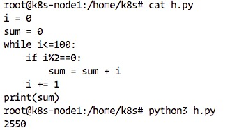
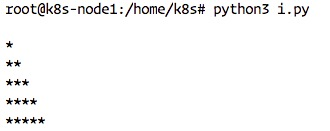
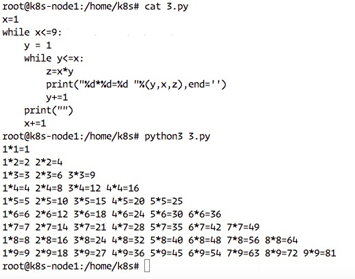
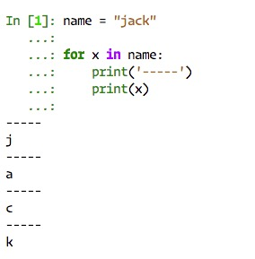
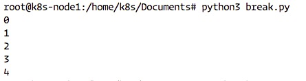
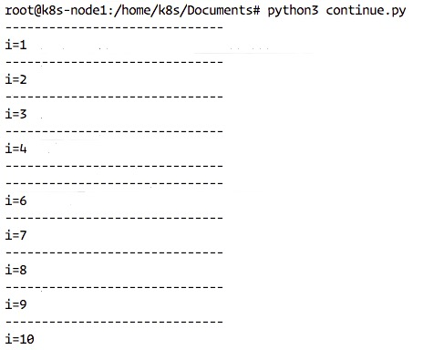
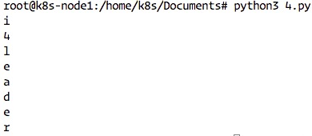

## Python 语法

### if 嵌套
使用方法:   
```
if xxxx:
   if yyyy:
   else xxxx
elif ssss:
   if dddd:
   else oooo:
else ssaa
```

#### 应用:猜拳游戏
*效果，和电脑进行猜拳游戏
代码:   
```
#!/usr/bin/python3
#coding:UTF-8
import random
#计算机赋值随机变量定义剪刀石头布
computerResult = random.choice([0,1,2])

#获取用户的剪刀石头布
userResult = int(input("请输入:剪刀(0) 石头(1) 布(2):"))

if userResult ==  0:
    if computerResult == 0:
        print("平局,要不再来一局.")
    elif computerResult == 1:
        print("You lose.")
    elif computerResult == 2:
        print("You win.")
elif userResult == 1:
    if computerResult == 1:
        print("平局,要不再来一局.")
    elif computerResult == 2:
        print("You lose.")
    elif computerResult == 1:
        print("You win.")
elif userResult == 2:
    if computerResult == 2:
        print("平局,要不再来一局.")
    elif computerResult == 1:
        print("You lose.")
    elif computerResult == 0:
        print("You win.")
else:
    print("Your input is invalid!")
```   

   

### 循环语句介绍
```
i = 0
while i<10:
    print("第一遍%d"%i)
    i += 1
```   
测试结果:   
   

### 小总结   
* 一般情况下，需要多次重复执行的代码，都可以用循环的方式来完成
* 循环不是必须要使用的，但是为了提高代码的重复使用率，所有有经验的开发者都会采用循环
   
使用While进行猜拳游戏，实例:   
```
#!/usr/bin/python3
#coding:UTF-8
import random
while True:
    #计算机赋值随机变量定义剪刀石头布
    computerResult = random.choice([0,1,2])

    #获取用户的剪刀石头布
    userResult = int(input("请输入:剪刀(0) 石头(1) 布(2):"))

    if userResult ==  0:
        if computerResult == 0:
            print("平局,要不再来一局.")
        elif computerResult == 1:
            print("You lose.")
        elif computerResult == 2:
            print("You win.")
    elif userResult == 1:
        if computerResult == 1:
            print("平局,要不再来一局.")
        elif computerResult == 2:
            print("You lose.")
        elif computerResult == 1:
            print("You win.")
    elif userResult == 2:
        if computerResult == 2:
            print("平局,要不再来一局.")
        elif computerResult == 1:
            print("You lose.")
        elif computerResult == 0:
            print("You win.")
    else:
        print("Your input is invalid!")
```    
测试结果:   
   

#### 计算1到100的所有值总和
```
i = 0
sum = 0
while i<100:
    i += 1
    sum += i
    print("第%d遍i=%d,sum=%d"%(i,i,sum))
    print("总和%d"%sum)
```
演示结果:   
   

#### 计算100以下所有3的倍数
```
i = 0
while i<=100:
    if i%3==0:
        print(i)
    i += 1
```   
演示结果:   
   

#### 计算1-100之间偶数的和
```
i = 0
sum = 0
while i<=100:
    if i%2==0:
        sum = sum + i
    i += 1
print(sum)
```   
显示结果：   


### while 循环嵌套
* 类似if的嵌套，while嵌套就是：while里面还有while
#### while嵌套的格式
```
while 条件1：

    条件1满足时，做的事情1
    条件1满足时，做的事情2
    条件1满足时，做的事情3
    ...(省略)...

    while 条件2：
        条件2满足时，做的事情1
        条件2满足时，做的事情2
        条件2满足时，做的事情3
        ...(省略)...
```

#### 打印*到如下的结果
```
*
**
***
****
*****
```
示例代码：   
```
i = 1
while i<=5:
    #方法1
    #print("*"*i)

    #方法2
    #控制一行中的个数
    j = 1
    while j<=i:
        print("*",end='')
        j+=1
    print("")
    i+=1
```
演示结果：   
   

#### 打印*到如下的结果
```
*
* *
* * *
* * * *
* * * * *
* * * *
* * *
* *
*
```   
示例代码：（这道题花了我三小时，不过做出来我也很开心）   
```
i=1
while i<=5:
    j = 1
    while j<=i:
        print("* ",end='')
        j+=1
    print("")
    i+=1
    if i==6:
        k = 4
        while k>=0:
            s = 1
            while s<=k:
                print("* ",end='')
                s+=1
            print("")
            k-=1
```   

#### 99 乘法表
**代码示例：**   
```
x=1
while x<=9:
    y = 1
    while y<=x:
        z=x*y
        print("%d*%d=%d "%(y,x,z),end='')
        y+=1
    print("")
    x+=1
```
**演示结果：**  
   


### break和continue
1. break
#### for 循环
* 普通的循环示例如下：   

```
name = "jack"

for x in name:
    print('-----')
    print(x)
```
运行结果：   
   

* 最简单的break示例   
   
```
i=0
while i<10:
    if i==5:
        break
    print("%d"%i)
    i+=1
```
运行结果：   
   

#### continue 示例
* 最简单的continue
    
```
i=0
while i<10:
    print("-"*30)
    i+=1
    if i==5:
        continue
    print("i=%d"%i)
```   
运行结果：   
   

### for 循环
```
for 临时变量 in 列表或者字符串等:
    循环满足条件时执行的代码
else:
    循环不满足条件时的代码
```   
演示代码：   
```
name = 'i4leader'

for x in name:
    print(x)
```   
运行结果：  
   


***
有兴趣一起学习的可以加我微信，大家一起交流。加我请备注"13天Python学习”
