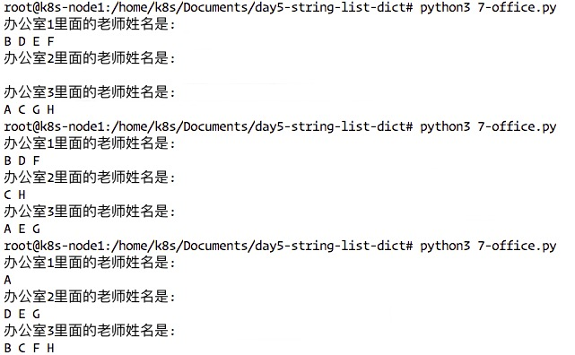
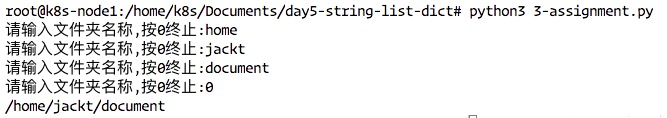

## Day5-字符串、列表、元祖、字典
### 字符串介绍
#### python 中字符串的格式
如下定义的变量a，存储的是数字类型的值   
```
a = 100
```
如下定义的变量b，存储的是字符串类型的值   
```
b = "hello github.com"
c = 'hello github.com'
```
小总结：   
* 双引号或者单引号中的数据，就是字符串
* 
### 字符串输出


### 字符串输入
input获取的数据，都是以字符串方式进行保存，包含输入的数字也是以字符串的方式保存。   
demo:   
```
userName = "i4leader"
print("用户名为:%s"%userName)

password = input("请输入密码:")
print("密码为:%s"%password)
```
结果：(根据输入的不同结果也不同)   
```
请输入用户名：i4leader
用户名为：i4leader
请输入密码:xxxxxxx
密码为:xxxxxxx
```


### 下标和切片
### 1. 下标索引
所谓“下标”，就是编号，就好比超市中的存储柜的编号，通过这个编号就能找到相应的存储空间
* 生活中的下标
  超市储物柜
* 字符串中’下标‘的使用
  **列表与元组支持下标索引好理解，字符串实际上就是字符的数组，所以也支持下标索引。**
  如果有字符串：name = 'i4leader' ,在内存中的实际存储如下：
|i|4|l|e|a|d|e|r|   
name[0]指"i"   
name[3]指"e"   
如果想取出部分字符，那么可以通过下标的方法，（注意在python中下标从0开始）   
**示例代码：**   
```
name = 'i4leader'
print(name)
print("-"*20)
print(name[0])
print("-"*20)
print(name[4])
```   
**输出结果：**
   

### 2. 切片
切片是指对操作的对象截取其中一部分的操作。**字符串、列表、元组**都支持切片操作。

#### 切片的语法:[起始位置:结束位置:步长]   
**注意：选取的区间属于左闭右开型，即从“起始”位开始，到“结束”位的前一位结束(不包含结束位本身)。**    
我们已字符串为例讲解。   
如果取出一部分，则可以在中括号[]中，使用:
```
name = ‘abcdef'
print(name[0:3])  #取下标0-2字符
```   
运行结果：   
   
* **还可以写成name[0:]或者name[3:]表示从第0位或者第三位一直到最后**
* **步长的意思是每隔几个字符取一位字符**
* **步长为-1的意思是，把字符串逆序进行输出**
* **name[-1]为最后一位字符，-2表示倒数第二位**


### 字符串常见操作
如有字符串 mystr ='hello world itcast and itcast'，以下是常见的操作.   

字符串的操作方法列表如下： 
```
mystr.capitalize   mystr.endswith     mystr.index        mystr.isidentifier mystr.istitle      mystr.lstrip       mystr.rindex       mystr.split        mystr.title        
mystr.casefold     mystr.expandtabs   mystr.isalnum      mystr.islower      mystr.isupper      mystr.maketrans    mystr.rjust        mystr.splitlines   mystr.translate    
mystr.center       mystr.find         mystr.isalpha      mystr.isnumeric    mystr.join         mystr.partition    mystr.rpartition   mystr.startswith   mystr.upper        
mystr.count        mystr.format       mystr.isdecimal    mystr.isprintable  mystr.ljust        mystr.replace      mystr.rsplit       mystr.strip        mystr.zfill        
mystr.encode       mystr.format_map   mystr.isdigit      mystr.isspace      mystr.lower        mystr.rfind        mystr.rstrip       mystr.swapcase       
```

##### (1)find
检测str是否包含在mystr中，如果是返回开始的索引值，否则返回-1   
```
mystr.find(str,start=0,end=len(mystr))
```   
  
##### (2)index   
跟find()方法一样，只不过如果str不在mystr中会报一个异常。  
```
mystr.index(str,start=0,end=len(mystr))
```   
##### (3)rfind,rindex
表示从右边开始找。   

##### (4)count
返回str在start和end之间在mystr里面出现的次数   
```
mystr.count(str,strat=0,end=len(mystr))
```

##### (5)replace
把mystr 中的str1 替换成str2，如果count指定，则替换不超过count次。
```
mystr.replace(str1,str2,mystr.ccount(str1))
```   
   

##### (6) split
以str为分隔符切片mystr,如果maxsplit有指定值，则仅分隔maxsplit个子字符串   
```
mystr.split(str="",2)
```   
   

##### (7) capitalize
把字符串的第一个字符大写   
```
mystr.capitalize()
```   
   

##### (8) title
把字符串的每个单词首字母大写   
```
In [40]: print(mystr)
ha ha lol lol ha ha lol

In [41]: mystr.title()
Out[41]: 'Ha Ha Lol Lol Ha Ha Lol'
```
##### (9) startswith
检查字符串是否是以obj开头，是则返回True，否则返回False   
```
mystr.startswith(obj)
```   
示例：   
```
In [40]: print(mystr)
ha ha lol lol ha ha lol

In [42]: mystr.startswith('ha')
Out[42]: True

In [43]: mystr.startswith('Ha')
Out[43]: False
```   

##### (10) endswith
检查字符串是否以obj结束，结果是返回True，否则返回False.   
```
mystr.endswith(obj)
```   
示例：   
```

In [40]: print(mystr)
ha ha lol lol ha ha lol

In [45]: mystr.endswith('lol')
Out[45]: True

In [46]: mystr.endswith('ha')
Out[46]: False
```   

##### (11) lower
转换mystr中所有大写字符为小写   
```
mystr.lower()
```
示例：   
```
In [55]: mystr
Out[55]: 'Ha ha lol lol ha ha lol'

In [56]: mystr = mystr.lower()

In [57]: mystr
Out[57]: 'ha ha lol lol ha ha lol'
```   

##### (12) upper
转换mystr中的小写字母为大写   
```
mystr.upper()
```
示例：   
```
In [59]: mystr.upper()
Out[59]: 'HA HA LOL LOL HA HA LOL'
```   

##### (13) ljust
返回一个原字符串左对齐，并使用空格填充至长度width的新字符串。  
```
mystr.ljust(width)
```
示例代码：   
```
In [71]: mystr = 'hello'

In [72]: mystr.ljust(10)
Out[72]: 'hello     '
```   

##### (14) rjust
返回一个原字符串右对齐，并使用空格填充至长度width的新字符串.   
```
mystr.rjust(width)
```   
示例代码：   
```
In [71]: mystr = 'hello'

In [72]: mystr.ljust(10)
Out[72]: 'hello     '

In [73]: mystr.rjust(10)
Out[73]: '     hello'
```   


##### (15) center
返回一个原字符串居中，并使用空格填充至长度width的新字符串。   
```
mystr.center(width)
```   
示例代码：   
```
In [74]: mystr = 'my world is beatiful'

In [75]: mystr.center(50)
Out[75]: '               my world is beatiful               '
```   

##### (16) lstrip
删除mystr左边的空白字符   
```
mystr.lstrip()
```   
示例代码：   
```
In [77]: mystr
Out[77]: '               my world is beatiful               '

In [78]: mystr.lstrip()
Out[78]: 'my world is beatiful               '
```   

##### (17) rstrip
```
mystr.rstrip()
```   
示例代码：   
```
In [77]: mystr
Out[77]: '               my world is beatiful               '

In [78]: mystr.lstrip()
Out[78]: 'my world is beatiful               '

In [79]: mystr.rstrip()
Out[79]: '               my world is beatiful'
```   

##### (18) strip
删除mystr字符串两端的空白字符   
```
In [80]: mystr.strip()
Out[80]: 'my world is beatiful'
```

##### (19)  rfind
类似于 find()函数，不过是从右边开始查找   
```
mystr.rfind(str,start=0,end=len(mystr))
```   
示例代码：   
```
In [83]: mystr
Out[83]: '               my world is beatiful               '

In [84]: mystr.rfind('my')
Out[84]: 15
```   

##### (20)rindex 
就是index函数从右边开始查找   
```
In [83]: mystr
Out[83]: '               my world is beatiful               '

In [85]: mystr.rindex('my')
Out[85]: 15
```  
##### (21) partition
把mystr以str分割成三部分，str前，str和str后   
```
mystr.partition(str)
```   
示例代码：   
```
In [86]: mystr
Out[86]: '               my world is beatiful               '

In [87]: mystr.partition('world')
Out[87]: ('               my ', 'world', ' is beatiful               ')
```   

##### (22) rpartition
类似于partition()函数，不过是从右边开始   
```
mystr.rpartition(str)
```   
示例代码： 
```
In [88]: mystr.rpartition('world')
Out[88]: ('               my ', 'world', ' is beatiful               ')
```   
##### (23) splitlines
按照行分隔，返回一行包含各行作为元素的列表   
```
mystr.splitlines()
```   
示例代码：    
```
In [95]: mystr = 'hello\njack'

In [96]: print(mystr)
hello
jack

In [97]: mystr.splitlines()
Out[97]: ['hello', 'jack']
```   
##### (24) isalpha,isalnum
isalpha--如果mystr所有的字符都是字母，则返回True，否则返回False   
isalnum--如果mystr所有的字符都输数字或字母，则返回True，否则返回False   
```
mystr.isalpha()

mystr.isalnum()

```   
代码示例：   
```
In [98]: mystr = 'abcdefg'

In [99]: phoneNumber = '18155551111'

In [100]: mystr.isalpha()
Out[100]: True

In [101]: mystr.isalnum()
Out[101]: True

In [102]: phoneNumber.isalpha()
Out[102]: False

In [103]: phoneNumber.isalnum()
Out[103]: True
```   
##### (25) isdigit
如果mystr只包含数字则返回True否则返回False.
```
mystr.isdigit()
```   
示例代码：   
```
In [105]: phoneNumber.isdigit()
Out[105]: True

In [106]: mystr.isdigit()
Out[106]: False
```   

#####  (26) isspace
如果mystr中只包含空格，则返回True，否则返回False.   
```
mystr.isspace()
```   
示例代码：   
```
In [108]: strA = '   '

In [109]: strA.isspace()
Out[109]: True
```   

##### (27) join
mystr 中每个字符后面插入str,构造出一个新的字符串   
```
mystr.join(str)
```   
代码示例：   
```
In [111]: strA = ' '

In [112]: li = ["my","name","is","jack"]

In [113]: strA.join(li)
Out[113]: 'my name is jack'

In [114]: strA = '_'

In [115]: strA.join(li)
Out[115]: 'my_name_is_jack'
```   


### 列表介绍
前面学习了字符串可以用来存储一串信息，那么如果存储更多的数据，譬如公司所有员工名字，我们用什么方式呢；定义10000个变量，每个变量存放一个学生的姓名？那么有更好的办法么？   
回答： 列表。   

#### <1>列表的格式
变量A的类型为列表   
```
namesList = ['xiaoming','hanmeimei','lilei']
```   
比C语言的数组强大的地方在于列表中的元素可以是不同类型的。   
```
namesList = [11,'aa','hello']
```   

#### <2>打印列表
代码示例:   
```
namesList = ['xiaoming','hanmeimei','lilei']
print(namesList[0])
print(namesList[1])
print(namesList[2])
```   
结果：   
```
In [1]: namesList = ['xiaoming','hanmeimei','lilei']

In [2]: namesList[0]
Out[2]: 'xiaoming'

In [3]: namesList[2]
Out[3]: 'lilei'

In [4]: namesList[1]
Out[4]: 'hanmeimei'
```   


### 列表的循环遍历
循环遍历：   
```
#方式1 for循环
In [5]: namesList
Out[5]: ['xiaoming', 'hanmeimei', 'lilei']

In [6]: for temp in namesList:
   ...:     print(temp)
   ...:     
xiaoming
hanmeimei
lilei
```   

```   
#方式2 while循环
In [8]: i = 0

In [9]: while i<len(namesList):
   ...:     print(namesList[i])
   ...:     i+=1
   ...:     
xiaoming
hanmeimei
lilei
```   

**小测试: 定义一个名字列表，并查找列表中的名字是否存在**   
```
#coding=utf-8

#1.定义一个列表,里面有一些名字
names = ['jack','harris','sunny','guang']

#2.获取一个要查找的名字
insertName = input('请输入您的名字:')

#3.判断是否存在,并显示相应的提示
findFlag = 0
for name in names:
    if name==insertName:
        findFlag = 1
        # 如果在前面已经找到了需要的名字,那么就结束循环,因为剩下的不会再进行判断,所以提升了程序的运行效率
        break
if findFlag == 1:
    print('找到了')
else:
    print('没找到')
```   
测试结果：   
```
root@k8s-node1:/home/k8s/Documents/day5-string-list-dict# python3 02.py 
请输入您的名字:jacck
没找到
root@k8s-node1:/home/k8s/Documents/day5-string-list-dict# python3 02.py 
请输入您的名字:jack
找到了
root@k8s-node1:/home/k8s/Documents/day5-string-list-dict# python3 02.py 
请输入您的名字:sunny
找到了
```   

### 列表的常见操作
列表中存放的数据是可以进行修改的，比如“增”，“删”，“改”   
#### <1> 添加元素("增"append,extend,insert)
##### 增 append
通过append可以向列表添加元素   
代码演示：   
```
#定义变量,默认有三个元素

ABC = ['apple','banana','orange']

print("-----添加之前,列表ABC的数据-----")
for tempName in ABC:
    print(tempName)

#提示,并添加元素
temp = input('请输入要添加的水果名:')
ABC.append(temp)

print("-----添加之后,列表ABC的数据-----")
for tempName in ABC:
    print(tempName)
```
输出结果：   
```
#python3 3-append.py 
-----添加之前,列表ABC的数据-----
apple
banana
orange
请输入要添加的水果名:watermelon
-----添加之后,列表ABC的数据-----
apple
banana
orange
watermelon
```   

##### extend
通过extend 可以将另一个集合中的元素逐一添加到列表中   
代码示例   
```
In [1]: a = [1,2]
In [2]: b = [3,4]
In [3]: a.append(b)
In [4]: a
Out[4]: [1, 2, [3, 4]]
In [5]: a.extend(b)
In [6]: a
Out[6]: [1, 2, [3, 4], 3, 4]
```   

##### insert
insert(index,object)在指定位置index前插入元素object   
```
In [7]: c = [3,4,5,6]
In [8]: c.insert(2,7)
In [9]: c
Out[9]: [3, 4, 7, 5, 6]
```   
#### <2> 修改元素
修改元素的时候，要通过下标来确定要修改的是哪个元素，然后才能进行修改   
演示：   
```
In [1]: A = ['xiaozhu','xiaotu','xiaoming']

In [2]: A[0]
Out[2]: 'xiaozhu'

In [3]: A[1]
Out[3]: 'xiaotu'

In [4]: A[2]
Out[4]: 'xiaoming'

In [5]: A[1] = 'xiaojin'

In [6]: A
Out[6]: ['xiaozhu', 'xiaojin', 'xiaoming'] 
```   

#### <3> 查找元素("查"in,not in,index,count)
所谓的查找，就是看看指定的元素是否存在   

**in,not in**   
python中查找的常用方法为：   
* in（存在），如果存在那么结果为true，否则为false
* not in（不存在），如果不存在那么结果为true，否则false

代码示例   
```
In [15]: names
Out[15]: ['a', 'b', 'c']

In [16]: inputName
Out[16]: 'a'

In [17]: inputName in names
Out[17]: True
```

**index,count**   
   
```
In [18]: names.count('a')
Out[18]: 1

In [19]: names.count('b')
Out[19]: 1

In [20]: names.count('d')
Out[20]: 0

In [21]: names.index('d')
---------------------------------------------------------------------------
ValueError                                Traceback (most recent call last)
<ipython-input-21-25c0ad3a4bb0> in <module>()
----> 1 names.index('d')

In [22]: names.index('a')
Out[22]: 0

In [23]: names.index('b')
Out[23]: 1

In [24]: names.index('c')
Out[24]: 2
```   

**index如果不存在会报错，count如果不存在会返回false。**   

#### <4> 删除元素("删"del,pop,remove)
类比现实生活中，如果某位同学调班了，那么就应该把这个调走后的学生的姓名删除掉；在开发中经常会用到删除这种功能。   

列表元素的常用删除方法有：   
* del: 根据下标进行删除
* pop：删除最后一个元素
* remove： 根据元素的值进行删除

代码示例：   
```
In [27]: names
Out[27]: ['b', 'c']

In [29]: names.pop()
Out[29]: 'c'

In [30]: names
Out[30]: ['b']

In [34]: names
Out[34]: ['a', 'b', 'cc']

In [35]: names.remove('cc')

In [36]: names
Out[36]: ['a', 'b']

In [37]: names.pop()
Out[37]: 'b'

In [38]: names
Out[38]: ['a']
```   

**练习：写一个名册系统，可以执行增删改查以及遍历操作**   

```
#coding=utf-8

#定义一个列表,用来存储所有的名字
names = []

while True:
    #1. 打印提示
    print("="*30)
    print("            欢迎使用xxxx系统 V6.8")
    print(" 1: 添加新名字")
    print(" 2: 删除一个名字")
    print(" 3: 修改一个名字")
    print(" 4: 查询一个名字")
    print(" 5: 遍历所有的名字")
    print(" 0: 退出系统")
    print("="*30)

    #2. 获取要操作的数字
    key = input('请输入您要操作的选项:')


    #3. 根据选择,来做相应的事情
    if key == "1":
        #3.1 提示用户输入一个新名字
        insertName = input("请输入要添加的名字:")
        #3.2 把用户输入的名字添加到列表中
        names.append(insertName)
    elif key == "2":
        #3.3 提示用户输入要删除的名字
        insertName = input("请输入要删除的名字:")
        #3.4 删除输入的名字
        names.remove(insertName)
    elif key == "3":
        #3.5 修改一个名字
        insertName = input("请输需要修改的名字:")
        if insertName in names:
        # 3.6 修改名字 
            i = names.index(insertName)
            modifyName = input("请输入新的名字")
            names[i] = modifyName
            # 3.7 如果输入的名字找到了则直接修改并退出到主程序
            continue
        else:
            print("名字不在数据库中,请重新输入.")

    elif key == "4":
        insertName = input("请输入要查询的名字:")
        if insertName in names:
            print("该名字存在")
            continue
    elif key == "5":
        print(names)
    elif key == "0":
        break

```   

#### <5> 排序 (sort,reverse)
sort方法是将list按特定顺序重新排列，默认为由小到大，参数reverse=True 可改为倒序，由大到小。   
reserve方法是将list逆置。   
```
In [1]: a = [4,5,3,7,2,0,1,6]

In [2]: a.reverse()

In [3]: a
Out[3]: [6, 1, 0, 2, 7, 3, 5, 4]

In [4]: a.sort()

In [5]: a
Out[5]: [0, 1, 2, 3, 4, 5, 6, 7]

In [6]: a.sort(reverse=True)

In [7]: a
Out[7]: [7, 6, 5, 4, 3, 2, 1, 0]

```   


### 列表的嵌套
#### 1. 列表嵌套
类似while循环的嵌套，列表也是支持嵌套的。   
一个列表中的元素又是一个列表，那么这就是列表的嵌套。   
```
schoolNames = [['北京大学','清华大学'],['南开大学','天津大学'],['山东大学','中国海洋大学']]
```   

#### 2.应用
一个学校，有三个办公室，现在有8位老师等待工位的分配，请编写程序，完成随机的分配   
代码示例：   
```
#coding=utf-8

import random

#1. 定义一个列表,嵌套的列表
rooms = [[],[],[]]

#2. 有一个列表,保存了8名老师的名字
teachers = ['A','B','C','D','E','F','G','H']

#3. 随机把8名老师的名字添加到第一个列表中
for name in teachers:
    randomNum = random.randint(0,2)
    rooms[randomNum].append(name)
i = 1
for room in rooms:
    print("办公室%d里面的老师姓名是:"%i)
    for name in room:
        print(name,end=" ")
    print("")
    i += 1
```   
演示结果：   
   


### 元组
Python 的元组与列表类似，不同之处在于**元组的元素不能修改**。元组使用小括号，列表使用方括号。   
```
In [1]: aTuple = ('a',333,3.14159265354)

In [2]: aTuple
Out[2]: ('a', 333, 3.14159265354)
```   

#### (1) 访问元组
```
In [2]: aTuple
Out[2]: ('a', 333, 3.14159265354)

In [3]: aTuple[0]
Out[3]: 'a'

In [4]: aTuple[1]
Out[4]: 333

In [5]: aTuple[2]
Out[5]: 3.14159265354
```   

#### (2) 修改元组  
```
In [6]: aTuple[2]=3.14
---------------------------------------------------------------------------
TypeError                                 Traceback (most recent call last)
<ipython-input-6-d9bad7d59b2f> in <module>()
----> 1 aTuple[2]=3.14

TypeError: 'tuple' object does not support item assignment

```   
说明：**python中不允许修改元组的数据，包括不能删除**

#### (3) 元组的内置函数count,index
index和count 与字符串和列表中的用法相同   
```
In [14]: aTuple
Out[14]: ('a', 333, 3.14159265354)

In [15]: aTuple.index('a')
Out[15]: 0

In [17]: aTuple.index(333)
Out[17]: 1

In [18]: aTuple.index(3.14159265354)
Out[18]: 2

In [19]: aTuple
Out[19]: ('a', 333, 3.14159265354)

In [20]: aTuple.count(3.14159265354)
Out[20]: 1

In [21]: aTuple.count(333)
Out[21]: 1

In [22]: aTuple.count('a')
Out[22]: 1

```   

### 字典介绍
字典是另一种可变容器模型，且可存储任意类型对象。

字典的每个键值 key=>value 对用冒号 : 分割，每个键值对之间用逗号 , 分割，整个字典包括在花括号 {} 中 ,格式如下所示：  
```
d = {key1 : value, key2 : value2 }  
```   
键一般是唯一的，如果重复最后的一个键值对会替换前面的，值不需要唯一。   
值可以取任何数据类型，但键必须是不可变的，如字符串，数字或元组。   

#### (1) 变量dictA为字典类型：
```
dictA = {'name':‘班花’,'id':100, 'sex':'f', 'address' : '中国上海'}
```   
说明：   
* 字典和列表一样，也能够存储多个数据
* 列表中找到某个元素时，是根据下标进行的
* 字典中找到某个元素时，是根据’名字‘（就是冒号：前面的那个值，例如上面代码中的’name‘、’id‘、’sex‘）
* 字典的每个元素由2个部分组成，键：值。例如’name':'班长'，‘name'为键，’班长‘为值。

   
#### (2) 根据键访问值
```
dictA = {'name':’班花‘,'id':100, 'sex':'f', 'address' : '中国上海'}
```   
代码示例：
```
In [27]: dictA['name']
Out[27]: '班花'
```   
   
### 字典的常见操作1
#### (1)修改元素
字典的每个元素中的数据是可以修改的，只要通过key找到，即可修改   
代码演示：   
```
In [29]: dictA['name']='校长'

In [30]: dictA
Out[30]: {'address': '中国上海', 'id': 100, 'name': '校长', 'sex': 'f'}

In [31]: dictA.get('name')  #查找元素
Out[31]: '校长'
```
    
#### (2)添加元素
如果键值不存在，可以直接等号的方式来添加：   
代码示例：   
```
In [32]: dictA
Out[32]: {'address': '中国上海', 'id': 100, 'name': '校长', 'sex': 'f'}

In [33]: dictA['money'] = 10111100

In [34]: dictA
Out[34]: {'address': '中国上海', 'id': 100, 'money': 10111100, 'name': '校长', 'sex': 'f'}
```   
   

#### (3)删除元素 del,clear
代码示例：   
```
In [35]: del dictA['money']

In [36]: dictA
Out[36]: {'address': '中国上海', 'id': 100, 'name': '校长', 'sex': 'f'} 

In [36]: dictA
Out[36]: {'address': '中国上海', 'id': 100, 'name': '校长', 'sex': 'f'}

In [37]: 

In [37]: dictA.clear()

In [38]: dictA
Out[38]: {}

```   


### 字典的常见操作2
#### (1)len()
测量字典中，键值对的个数   
```
In [40]: dictA
Out[40]: {'address': '中国上海', 'id': 100, 'name': '校长', 'sex': 'f'}

In [41]: len(dictA)
Out[41]: 4
```   

#### (2)keys
返回一个包含字典的所有key的列表   
```
In [42]: dictA.keys()
Out[42]: dict_keys(['address', 'id', 'name', 'sex'])
```   

#### (3)values
返回一个包含字典所有value的列表   
```
In [43]: dictA.values()
Out[43]: dict_values(['中国上海', 100, '校长', 'f'])
```   

#### (4)items
返回一个包含所有（键，值）元祖的列表   
```
In [44]: dictA.items()
Out[44]: dict_items([('address', '中国上海'), ('id', 100), ('name', '校长'), ('sex', 'f')])
```   
思考一下：   
列表中是否可以包含字典？   
   

#### (5)has_key
dict.has_key(key)如果key在字典中，返回True，否则返回False   
```
In [1]: dictA = {'address': '中国上海', 'id': 100, 'name': '校长', 'sex': 'f'}

In [2]: dictA.has_key
Out[2]: <function has_key>

In [3]: dictA.has_key('addresss')
Out[3]: False

In [4]: dictA.has_key('address')
Out[4]: True

```   
**注意：该函数只在python2中使用，python3中没有此函数**

### 字典的遍历
使用for...in...来遍历所有值   
#### 字符串遍历
```
stringA = 'hello world'
for char in stringA:
    print(char,end=' ')
```   

#### 列表遍历
```
In [2]: listA = [1,2,3,4,5]

In [3]: for L in listA:
   ...:     print(L,end=' ')
   ...:
1 2 3 4 5 
```   
#### 元祖遍历
```
In [10]: tupleA = ('A','B','D')

In [11]: for item in tupleA:
    ...:     print(item,end=' ')
    ...:     
A B D 
```   
   
#### 字典的遍历
#### <1> 遍历字典的key(键)
```
In [15]: dictA = {'name':'jack','age':18,'like':'beauty' }

In [16]: for key in dictA.keys():
    ...:     print(key)
    ...:     
name
age
like
```   

#### <2> 遍历字典的value(值)
```
In [15]: dictA = {'name':'jack','age':18,'like':'beauty' }

In [17]: for value in dictA.values():
    ...:     print(value)
    ...:     
jack
18
beauty
```   
#### <3> 遍历字典的项(元素)
```
In [18]: for item in dictA.items():
    ...:     print(item)
    ...:     
('name', 'jack')
('age', 18)
('like', 'beauty')
```   

#### <2> 遍历字典的key-value(键值对)
```
#方法一：
In [19]: for key,value in dictA.items():
    ...:     print('key=%s,value=%s'%(key,value))
    ...:     
key=name,value=jack
key=age,value=18
key=like,value=beauty

#方法二：
In [21]: for item in dictA.items():
    ...:     print("%s:%s"%(item[0],item[1]))
    ...:     
name:jack
age:18
like:beauty
```   

#### 小练习：
如何实现带下标索引的遍历   
```
传统方式：
In [28]: listA
Out[28]: ['a', 'b', 'c', 'd']

In [29]: i=0

In [30]: for l in listA:
    ...:     print("listA[%d]=%s"%(i,l))
    ...:     i+=1
    ...:     
listA[0]=a
listA[1]=b
listA[2]=c
listA[3]=d
```   
#### enumerate()
```
In [40]: for i,l in enumerate(listA):
    ...:     print("listA[%d]:%s"%(i,l))
    ...:     
    ...:     
listA[0]:a
listA[1]:b
listA[2]:c
listA[3]:d

```   


### 公共方法
#### 运算符   
    
| 运算符  | python表达式  | 结果  | 描述 | 支持的数据类型  |
| :---- | :---- | :----| :-----| :------|
| + | [1,2]+[3,4] | [1,2,3,4] | 合并 | 字符串、列表、元组 |
| * | 'Hi!'*4 | ['Hi!','Hi!','Hi!','Hi!',] | 复制 | 字符串、列表、元组 |
| in | 3 in (1,2,3) | True | 元素是否存在 | 字符串、列表、元组、字典 |
| not in | 4 not in (1,2,3) | True | 元素是否不存在 | 字符串、列表、元组、字典 |   

➕号 和 星*号 
```
In [41]: 'hello' + 'world'
Out[41]: 'helloworld'

In [42]: 'hello ' + 'world'
Out[42]: 'hello world'

In [43]: 'hello world!'*3
Out[43]: 'hello world!hello world!hello world!'

```

in   
```
In [44]: dictA
Out[44]: {'age': 18, 'like': 'beauty', 'name': 'jack'}

In [45]: 'age' in dictA
Out[45]: True

In [46]: 'beauty' in dictA
Out[46]: False
```   
注意：in在对字典的操作时，判断的是字典的键   

### Python内置函数
python 包含以下内置函数,python3没有这些函数   
| 序号 | 方法 | 描述 |
| :----| :----| :---- |
|1|cmp(item1,item2)| 比较两个值 |
|2|len(item)| 计算容器中元素大小 |
|3|max(item)| 返回容器中元素最大值 |
|4|min(item) | 返回容器中元素最小值 |
|5|del(item) | 删除变量 |

#### cmp 
该内置函数只存在python2中   
```
>>> cmp('a','b')
-1
>>> cmp('b','a')
1
>>> cmp('b','b')
0
```   

#### max 和min
```
>>> max('22','11')
'22'
>>> min('22','11')
'11'

```   

#### len
```
>>> a = ("aa","11","33")
>>> len(a)
3
```   
#### del
```
>>> a
('11', '22')
>>> del(a)
>>> a
Traceback (most recent call last):
  File "<stdin>", line 1, in <module>
NameError: name 'a' is not defined
```   

### 引用


### 作业
#### 1.学生管理器


#### 2.
* 统计字符串，各个字符的个数
* 比如：“hello world”字符串统计的结果为：h:1 e:1 l:3 o:2 d:1 r:1 w:1   
     
```
#coding=utf-8

#1.获得输入的字符串
str = input("请输入字符串:")

#2.判断字符串的字符个数
j = len(str)
i=0
#2.1 定义一个空的字典用来存放字符以及出现的次数
dictA = {}
#2.2 while循环将计算出来的key:value保存到字典
while i<j:
    c = str.count(str[i])
    dictA[str[i]] = c
    i += 1
for key,value in dictA.items():
    print("%s:%d"%(key,value),end=' ')
print("")    
```   
代码演示：   
```
root@k8s-node1:/home/k8s/Documents/day5-string-list-dict# python3 2-assignment.py 
请输入字符串:ssshhhhhhhhajjjjk8654zxc
s:3 h:8 a:1 j:4 k:1 8:1 6:1 5:1 4:1 z:1 x:1 c:1 
```   

#### 3.编写程序，完成以下要求：  
* 完成一个路径的组装
* 先提示用户多次输入路径，最后显示一个完成的路径，比如/home/python/ftp/share   
    
```
root@k8s-node1:/home/k8s/Documents/day5-string-list-dict# cat 3-assignment.py 
#coding=utf-8

#1.定义一个列表来存放路径
path = []
#2. 获取输入文件夹
while True:
    while True:
        j = input("请输入文件夹名称,按0终止:")
        # 2.1 定义终止条件
        if j == "0":
            break
        # 2.2 列表赋值
        path.append(j)
    # 3. 循环打印列表数值
    for folder in path:
        print("/%s"%folder,end='')
    print("")
    break
```   
示例结果：   
   


#### 4.编写程序，完成"名片管理器"项目   
* 需要完成的基本功能：
  1. 添加名片
  2. 删除名片
  3. 修改名片
  4. 查询名片
  5. 退出系统
* 程序运行后，除非选择退出系统，否则重复执行功能   
    


***
有兴趣一起学习的可以加我微信，大家一起交流。加我请备注“13天Python学习”
