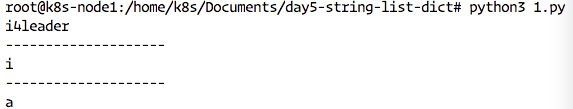
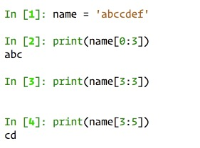
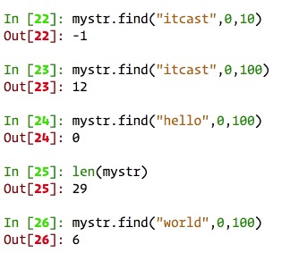
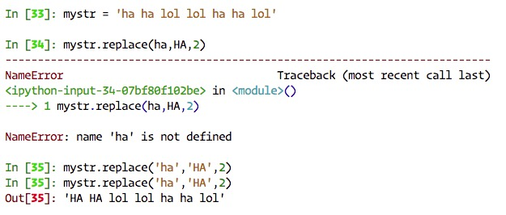
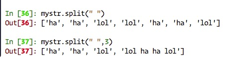
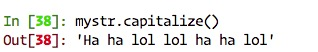

## Day5-字符串、列表、元祖、字典
### 字符串介绍
#### python 中字符串的格式
如下定义的变量a，存储的是数字类型的值   
```
a = 100
```
如下定义的变量b，存储的是字符串类型的值   
```
b = "hello github.com"
c = 'hello github.com'
```
小总结：   
* 双引号或者单引号中的数据，就是字符串
* 
### 字符串输出


### 字符串输入
input获取的数据，都是以字符串方式进行保存，包含输入的数字也是以字符串的方式保存。   
demo:   
```
userName = "i4leader"
print("用户名为:%s"%userName)

password = input("请输入密码:")
print("密码为:%s"%password)
```
结果：(根据输入的不同结果也不同)   
```
请输入用户名：i4leader
用户名为：i4leader
请输入密码:xxxxxxx
密码为:xxxxxxx
```


### 下标和切片
### 1. 下标索引
所谓“下标”，就是编号，就好比超市中的存储柜的编号，通过这个编号就能找到相应的存储空间
* 生活中的下标
  超市储物柜
* 字符串中’下标‘的使用
  **列表与元组支持下标索引好理解，字符串实际上就是字符的数组，所以也支持下标索引。**
  如果有字符串：name = 'i4leader' ,在内存中的实际存储如下：
|i|4|l|e|a|d|e|r|   
name[0]指"i"   
name[3]指"e"   
如果想取出部分字符，那么可以通过下标的方法，（注意在python中下标从0开始）   
**示例代码：**   
```
name = 'i4leader'
print(name)
print("-"*20)
print(name[0])
print("-"*20)
print(name[4])
```   
**输出结果：**
   

### 2. 切片
切片是指对操作的对象截取其中一部分的操作。**字符串、列表、元组**都支持切片操作。

#### 切片的语法:[起始位置:结束位置:步长]   
**注意：选取的区间属于左闭右开型，即从“起始”位开始，到“结束”位的前一位结束(不包含结束位本身)。**    
我们已字符串为例讲解。   
如果取出一部分，则可以在中括号[]中，使用:
```
name = ‘abcdef'
print(name[0:3])  #取下标0-2字符
```   
运行结果：   
   
* **还可以写成name[0:]或者name[3:]表示从第0位或者第三位一直到最后**
* **步长的意思是每隔几个字符取一位字符**
* **步长为-1的意思是，把字符串逆序进行输出**
* **name[-1]为最后一位字符，-2表示倒数第二位**


### 字符串常见操作
如有字符串 mystr ='hello world itcast and itcast'，以下是常见的操作.   

字符串的操作方法列表如下： 
```
mystr.capitalize   mystr.endswith     mystr.index        mystr.isidentifier mystr.istitle      mystr.lstrip       mystr.rindex       mystr.split        mystr.title        
mystr.casefold     mystr.expandtabs   mystr.isalnum      mystr.islower      mystr.isupper      mystr.maketrans    mystr.rjust        mystr.splitlines   mystr.translate    
mystr.center       mystr.find         mystr.isalpha      mystr.isnumeric    mystr.join         mystr.partition    mystr.rpartition   mystr.startswith   mystr.upper        
mystr.count        mystr.format       mystr.isdecimal    mystr.isprintable  mystr.ljust        mystr.replace      mystr.rsplit       mystr.strip        mystr.zfill        
mystr.encode       mystr.format_map   mystr.isdigit      mystr.isspace      mystr.lower        mystr.rfind        mystr.rstrip       mystr.swapcase       
```

##### (1)find
检测str是否包含在mystr中，如果是返回开始的索引值，否则返回-1   
```
mystr.find(str,start=0,end=len(mystr))
```   
  
##### (2)index   
跟find()方法一样，只不过如果str不在mystr中会报一个异常。  
```
mystr.index(str,start=0,end=len(mystr))
```   
##### (3)rfind,rindex
表示从右边开始找。   

##### (4)count
返回str在start和end之间在mystr里面出现的次数   
```
mystr.count(str,strat=0,end=len(mystr))
```

##### (5)replace
把mystr 中的str1 替换成str2，如果count指定，则替换不超过count次。
```
mystr.replace(str1,str2,mystr.ccount(str1))
```   
   

##### (6) split
以str为分隔符切片mystr,如果maxsplit有指定值，则仅分隔maxsplit个子字符串   
```
mystr.split(str="",2)
```   
   

##### (7) capitalize
把字符串的第一个字符大写   
```
mystr.capitalize()
```   
   

##### (8) title
把字符串的每个单词首字母大写   
```
In [40]: print(mystr)
ha ha lol lol ha ha lol

In [41]: mystr.title()
Out[41]: 'Ha Ha Lol Lol Ha Ha Lol'
```
##### (9) startswith
检查字符串是否是以obj开头，是则返回True，否则返回False   
```
mystr.startswith(obj)
```   
示例：   
```
In [40]: print(mystr)
ha ha lol lol ha ha lol

In [42]: mystr.startswith('ha')
Out[42]: True

In [43]: mystr.startswith('Ha')
Out[43]: False
```   

##### (10) endswith
检查字符串是否以obj结束，结果是返回True，否则返回False.   
```
mystr.endswith(obj)
```   
示例：   
```

In [40]: print(mystr)
ha ha lol lol ha ha lol

In [45]: mystr.endswith('lol')
Out[45]: True

In [46]: mystr.endswith('ha')
Out[46]: False
```   

##### (11) lower
转换mystr中所有大写字符为小写   
```
mystr.lower()
```
示例：   
```
In [55]: mystr
Out[55]: 'Ha ha lol lol ha ha lol'

In [56]: mystr = mystr.lower()

In [57]: mystr
Out[57]: 'ha ha lol lol ha ha lol'
```   

##### (12) upper
转换mystr中的小写字母为大写   
```
mystr.upper()
```
示例：   
```
In [59]: mystr.upper()
Out[59]: 'HA HA LOL LOL HA HA LOL'
```   

##### (13) ljust
返回一个原字符串左对齐，并使用空格填充至长度width的新字符串。  
```
mystr.ljust(width)
```
示例代码：   
```
In [71]: mystr = 'hello'

In [72]: mystr.ljust(10)
Out[72]: 'hello     '
```   

##### (14) rjust
返回一个原字符串右对齐，并使用空格填充至长度width的新字符串.   
```
mystr.rjust(width)
```   
示例代码：   
```
In [71]: mystr = 'hello'

In [72]: mystr.ljust(10)
Out[72]: 'hello     '

In [73]: mystr.rjust(10)
Out[73]: '     hello'
```   


##### (15) center
返回一个原字符串居中，并使用空格填充至长度width的新字符串。   
```
mystr.center(width)
```   
示例代码：   
```
In [74]: mystr = 'my world is beatiful'

In [75]: mystr.center(50)
Out[75]: '               my world is beatiful               '
```   

##### (16) lstrip
删除mystr左边的空白字符   
```
mystr.lstrip()
```   
示例代码：   
```
In [77]: mystr
Out[77]: '               my world is beatiful               '

In [78]: mystr.lstrip()
Out[78]: 'my world is beatiful               '
```   

##### (17) rstrip
```
mystr.rstrip()
```   
示例代码：   
```
In [77]: mystr
Out[77]: '               my world is beatiful               '

In [78]: mystr.lstrip()
Out[78]: 'my world is beatiful               '

In [79]: mystr.rstrip()
Out[79]: '               my world is beatiful'
```   

##### (18) strip
删除mystr字符串两端的空白字符   
```
In [80]: mystr.strip()
Out[80]: 'my world is beatiful'
```

##### (19)  rfind
类似于 find()函数，不过是从右边开始查找   
```
mystr.rfind(str,start=0,end=len(mystr))
```   
示例代码：   
```
In [83]: mystr
Out[83]: '               my world is beatiful               '

In [84]: mystr.rfind('my')
Out[84]: 15
```   

##### (20)rindex 
就是index函数从右边开始查找   
```
In [83]: mystr
Out[83]: '               my world is beatiful               '

In [85]: mystr.rindex('my')
Out[85]: 15
```  
##### (21) partition
把mystr以str分割成三部分，str前，str和str后   
```
mystr.partition(str)
```   
示例代码：   
```
In [86]: mystr
Out[86]: '               my world is beatiful               '

In [87]: mystr.partition('world')
Out[87]: ('               my ', 'world', ' is beatiful               ')
```   

##### (22) rpartition
类似于partition()函数，不过是从右边开始   
```
mystr.rpartition(str)
```   
示例代码： 
```
In [88]: mystr.rpartition('world')
Out[88]: ('               my ', 'world', ' is beatiful               ')
```   
##### (23) splitlines
按照行分隔，返回一行包含各行作为元素的列表   
```
mystr.splitlines()
```   
示例代码：    
```
In [95]: mystr = 'hello\njack'

In [96]: print(mystr)
hello
jack

In [97]: mystr.splitlines()
Out[97]: ['hello', 'jack']
```   
##### (24) isalpha,isalnum
isalpha--如果mystr所有的字符都是字母，则返回True，否则返回False   
isalnum--如果mystr所有的字符都输数字或字母，则返回True，否则返回False   
```
mystr.isalpha()

mystr.isalnum()

```   
代码示例：   
```
In [98]: mystr = 'abcdefg'

In [99]: phoneNumber = '18155551111'

In [100]: mystr.isalpha()
Out[100]: True

In [101]: mystr.isalnum()
Out[101]: True

In [102]: phoneNumber.isalpha()
Out[102]: False

In [103]: phoneNumber.isalnum()
Out[103]: True
```   
##### (25) isdigit
如果mystr只包含数字则返回True否则返回False.
```
mystr.isdigit()
```   
示例代码：   
```
In [105]: phoneNumber.isdigit()
Out[105]: True

In [106]: mystr.isdigit()
Out[106]: False
```   

#####  (26) isspace
如果mystr中只包含空格，则返回True，否则返回False.   
```
mystr.isspace()
```   
示例代码：   
```
In [108]: strA = '   '

In [109]: strA.isspace()
Out[109]: True
```   

##### (27) join
mystr 中每个字符后面插入str,构造出一个新的字符串   
```
mystr.join(str)
```   
代码示例：   
```
In [111]: strA = ' '

In [112]: li = ["my","name","is","jack"]

In [113]: strA.join(li)
Out[113]: 'my name is jack'

In [114]: strA = '_'

In [115]: strA.join(li)
Out[115]: 'my_name_is_jack'
```   


### 列表介绍


### 列表的循环遍历


### 列表的常见操作


### 列表的嵌套


### 元组


### 字典介绍


### 字典的常见操作1


### 字典的常见操作2


### 字典的遍历


### 公共方法


### 引用


### 作业


***
有兴趣一起学习的可以加我微信，大家一起交流。加我请备注“13天Python学习”
