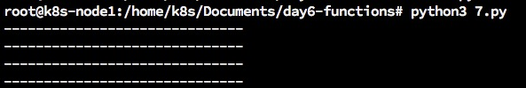
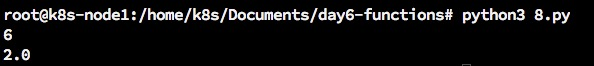
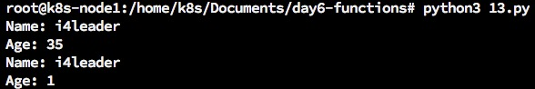
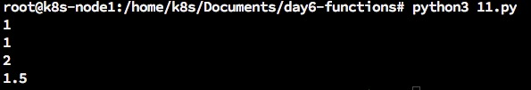
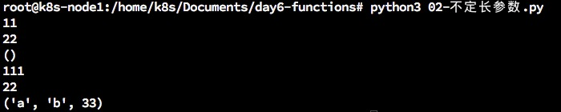
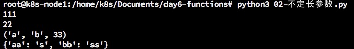
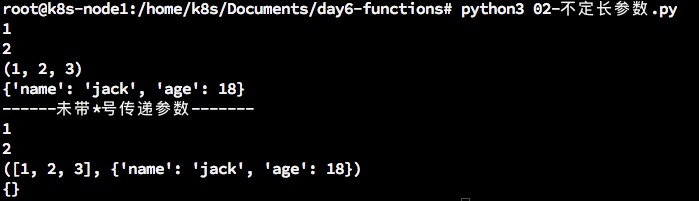
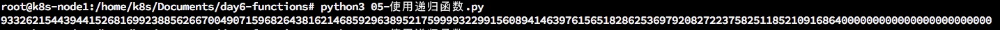

## Day6 - 函数
***
### 6.1. 函数介绍
一块具有独立功能的代码块，重复使用，那么往往就需要使用函数，使用函数把这块代码封装成一个整体。

### 6.2. 函数的定义、调用
#### <1>定义函数:   
定义一个函数的时候，这个函数不会被执行   
```
def 函数名():
    函数代码(函数要执行的代码)
```   
#### <2>调用函数:   
定义了函数之后，就相当于有了一个具有某些功能的代码，想要让这些代码能够执行，需要调用它。
函数调用很简单，只需要**函数名()**就可以完成调用   
函数只需要定义一次，然后就可以调用N次   
```
函数名() 
```   

#### <3>练一练:
要求:定义一个函数，能够输出自己的姓名和年龄，并且调用这个函数让它执行   
* 使用def定义函数
* 编写完函数之后，通过**函数名()**进行调用

   
```
root@k8s-node1:/home/k8s/Documents/day6-函数# cat 1.py 
def printmyinfo():
    print("姓名:jack\n年龄:18")
printmyinfo()
root@k8s-node1:/home/k8s/Documents/day6-函数# python3 1.py 
姓名:jack
年龄:18
```   

### 6.3. 函数的文档说明
```
>>> def test(a,b):
...     "完成对两个数的求和"
...     print("%d"%(a+b))
... 
>>> test(1,2)
3
```   
如果执行以下代码   
```
help(test)
```   
能够看到test函数的相关说明   
```
Help on function test in module __main__:

test(a, b)
    完成对两个数的求和
```   

### 6.4. 函数参数(1)
```
def sum2num(num1,num2):
    "两个数求和"
    print(num1+num2)
```   
以上函数num1,num2就是形式参数，函数sum2num叫做参数函数。   
调用的函数实际传递的参数叫实参。譬如sum2num(1,2),那1和2就是实际参数   
定义的函数如果有2个参数，那实际使用的时候必须传递2个实参，如果少一个参数，则会报错。   
并且形参和实参的顺序是一一对应的。  
定义函数前面不能加空格。   

练一练:写一个函数，并且从外部获取数据并求和   
```
root@k8s-node1:/home/k8s/Documents/day6-函数# cat 03-canshu.py 
def sum2num(num1,num2):
    "两个数求和"
    print(num1+num2)

sum2num(int(input("1:")),int(input("2:")))
root@k8s-node1:/home/k8s/Documents/day6-函数# python3 03-canshu.py 
1:22
2:344
366
```   

### 6.5. 函数返回值(1)
#### <1> ”返回值“介绍
场景介绍:   
> 定义了一个函数，完成了获取室内的温度，想一想是不是应该把这个结果给调用者，只有调用者获取了这个返回值，才能够根据当前的温度做适当的调整  

*所谓”返回值“，就是程序中函数完成一件事情后，最后给调用者的结果   

#### <2>带有返回值的函数
想要在函数中把结果返回给调用者，需要在函数中使用return   
如下示例:   
```
root@k8s-node1:/home/k8s/Documents/day6-函数# cat 02.py 
def sum2num(num1,num2):
    "两个数求和"
    return num1+num2

result = sum2num(int(input("1:")),int(input("2:")))
print(result)
root@k8s-node1:/home/k8s/Documents/day6-函数# python3 02.py 
1:101
2:102
203
```   


return有两个功能:   
* 把一个结果返回给调用者
* 结束一个函数
* 函数中可以写多个return，但是只有第一个return会返回值。原因是第一个return被执行后，这个函数就结束了，所有接下来的return都不会被执行了。     


### 6.6. 4中函数类型
函数根据有没有参数，有没有返回值，可以互相结合，一共有四种   
* 无参数，无返回值
* 无参数，有返回值
* 有参数，无返回值
* 有参数，有返回值
  
#### <1>无参数，无返回值的函数
此类函数，不能接受参数，也没有返回值，一般情况下，打印提示等类似的功能，使用这类的函数   
```
def printMenu():
    print("------------------")
    print("         点播系统"
    print("   1. 电影")
    print("   2. 电视剧"
    print("------------------")
```
  
#### <2>无参数，有返回值的函数
此类函数，不能接受参数，但是可以返回某个数据，一般情况下，像采集数据，用此类函数   
```
#导入os模块；获取当前路径
os.getcwd()
```
  
#### <3>有参数，无返回值的函数
此类函数，能接受参数，但不可以返回数据，一般情况下，对某些变量设置数据而不需结果时，用此类函数   
  
#### <4>有参数，有返回值的函数
此类函数，不仅能接受参数，还可以返回某个数据，一般情况下，想数据处理并需要结果的应用，用此类函数   
```
root@k8s-node1:/home/k8s/Documents/day6-functions# cat 4.py 
#coding=utf-8
# 计算1~num的累积和
def caculateNum(num):
    result = 0
    i = 1
    while i <= num:
        result = result + i
        i += 1
    return result

a = caculateNum(100)
print(a)
root@k8s-node1:/home/k8s/Documents/day6-functions# cat 4.py 
#coding=utf-8
# 计算1~num的累积和
def caculateNum(num):
    result = 0
    i = 1
    while i <= num:
        result = result + i
        i += 1
    return result

a = caculateNum(100)
print(a)

```   
运行结果:   
```
root@k8s-node1:/home/k8s/Documents/day6-functions# python3 4.py 
5050
```   


### 6.7. 函数的嵌套调用
* 一个函数里面又调用了另外一个函数，这就是所谓的函数嵌套调用   
     
```
def functionB():
    print '----------functionB start----------'
    print '这里是testB函数执行的代码...(省略)...'
    print '------- functionB end --------'

def functionA():
    print '---- functionA start----'
    functionB()
    print '---- functionA end----'

functionA()

```   
* 如果函数A中，调用了另外一个函数B，那么先把函数B中的任务都执行完毕之后才会回到上次函数A执行的位置   


### 6.8. 函数应用:打印图形和数学计算
#### 目标
* 感受函数的嵌套调用
* 感受程序设计的思路，复杂问题分解为简单问题
   
#### 思考与实现1   
1. 写一个函数打印一条横线
2. 打印自定义行数的横线

   
#### 参考代码1

```
#coding=utf-8
#打印一条横线
def printOneLine():
    print("-"*30)

def printMultiLines(num):
    i = 0
    while i < num:
        printOneLine()
        i+=1

printOneLine()
printMultiLines(3)

```   
输出结果:  
   

#### 思考与实现2
1. 写一个函数求三个数的和
2. 写一个函数求三个数的平均值
    
#### 参考代码2
```
#coding=utf-8
# 1. 定义一个函数完成三个数的求和
def sum3int(a,b,c):
    result = a+b+c
    return result

# 2. 定义一个函数完成三个数的平均值
def average3int(a,b,c):
    result = (a+b+c)/3
    return result

print(sum3int(1,2,3))
print(average3int(1,2,3))

```   
运行结果:   
   

### 6.9. 局部变量
函数内部定义的变量，叫做局部变量。   
示例代码:   
```
import time
def test1():
    num = 100
    print(num)
    
def test2():
    num = 200
    print(num)
    
    time.sleep(1)
    
    num = num + 100
    
    print(num)
    
test1()
test2()
```   
例如如上num就是局部变量，num只在定义它的函数中有效，出了这个函数，这个变量就消失了   
形式参数也是局部变量   

### 6.10. 全局变量
如果一个变量在函数内可用，出了函数也可以使用，那就是全局变量。   
在函数外边定义的变量就是全局变量.   
示例代码:   
```
#coding=utf-8
# 在函数外边定义的变量就是全局变量

num = 100

def test1():
    global num
    print(num)
    num += 2

def test2():
    print(num)
    
test1()
test2()
```  
以上代码中num就是全局变量。   
* 任何函数都能直接获取全部变量的值。   
* python中全局变量无法在函数中赋值。    
* 如果需要在函数中对全局变量进行赋值，则可以加global num进行声明


### 6.11. 函数应用:学生管理系统
**示例应用:利用函数嵌套完成学生管理系统**   

```
#coding=utf-8
# 打印功能提示
def printMenu():
    print("="*30)
    print("      学生管理系统V1.0")
    print("1.添加学生信息")
    print("2.删除学生信息")
    print("3.修改学生信息")
    print("4.查询学生信息")
    print("5.显示所有学生信息")
    print("0.退出系统")
    print("="*30)

# 获取一个学生的信息
# 全局变量

newName = ""
newSex = ""
newPhone = ""
def getInfo():

    global newName
    global newSex
    global newPhone

    #3.1 提示并获取学生的姓名
    newName = input("请输入新学生的名字:")
    newSex = input("请输入新学生的性别:(男/女)")
    newPhone = input("请输入新学生的电话号码:")

#用来修改一个学生的信息
def modifyStuInfo():
    stuId = int(input("请输入要修改的学生的序号:"))
    # 这里就使用了函数嵌套,调用了getInfo()函数来完成学生信息的修改
    getInfo()
    
    stuInfo[stuId-1]['name'] = newName
    stuInfo[stuId-1]['sex'] = newSex
    stuInfo[stuId-1]['phone'] = newPhone


def addStuInfo():
    getInfo()
    
    newInfo = {}
    newInfo['name'] = newName
    newInfo['sex'] = newSex
    newInfo['phone'] = newPhone
    
    stuInfo.append(newInfo)

# 打印所有学生信息
def printStuInfo():
    printStuinfoHeader()
    i = 1
    for tempInfo in stuInfo:
        print("%d     %s     %s     %s"%(i,tempInfo['name'],tempInfo["sex"],tempInfo["phone"]))
        i += 1

# 打印学生信息列表头
def printStuinfoHeader():
    print("="*30)
    print("学生的信息如下:")
    print("="*30)
    print('序号   姓名   性别   手机号码')


# 定义列表
stuInfo = []

def main():
        
    while True:
        #1. 打印功能提示
        printMenu()

        #2. 获取功能选项
        key = input("请输入功能序号:")


        #3.根据用户的选择,进行相应的操作
        if key == "1":
            #添加学生信息
            addStuInfo()

        elif key == "2":
            #2.0 删除学生信息

            #2.1 提示并获取需要修改的学生序号
            stuId = int(input("请输入要修改的学生序号:"))
            del stuInfo[stuId - 1]         

        elif key == "3":
            #修改学生信息
            #3.1 提示并获取需要修改的学生序号
            modifyStuInfo()

        elif key == "4":
            #查询学生信息
            stuId = int(input("请输入要修改的学生序号:"))
            printStuinfoHeader()
            print("%d     %s     %s     %s"%(stuId,stuInfo[stuId-1]['name'],stuInfo[stuId-1]["sex"],stuInfo[stuId-1]["phone"]))


        elif key == "5":
            #显示所有学生信息
            #print(stuInfo)
            printStuInfo()

        elif key == "0":
            #退出系统
            break
        
        else:
            print("输入错误,请重新输入.")
            continue

main()
#
```   

### 6.12. 函数的返回值(2)
#### 在python中我们可不可以返回多个值？
回答:可以，其实是借助了列表的功能   
示例代码:   
```
#coding=utf-8
# 打印功能提示
def printMenu():
    print("="*30)
    print("      学生管理系统V1.0")
    print("1.添加学生信息")
    print("2.删除学生信息")
    print("3.修改学生信息")
    print("4.查询学生信息")
    print("5.显示所有学生信息")
    print("0.退出系统")
    print("="*30)

# 获取一个学生的信息
# 全局变量

newName = ""
newSex = ""
newPhone = ""
def getInfo():

#    global newName
#    global newSex
#    global newPhone

    #3.1 提示并获取学生的姓名
    newName = input("请输入新学生的名字:")
    newSex = input("请输入新学生的性别:(男/女)")
    newPhone = input("请输入新学生的电话号码:")
    # 这里就用了函数返回多个值
    return [newName,newSex,newPhone]  

#用来修改一个学生的信息
def modifyStuInfo():
    stuId = int(input("请输入要修改的学生的序号:"))
    # 这里就使用了函数嵌套,调用了getInfo()函数来完成学生信息的修改
    result = getInfo() #['jack','男','10086']
    
    stuInfo[stuId-1]['name'] = result[0]
    stuInfo[stuId-1]['sex'] = result[1]
    stuInfo[stuId-1]['phone'] = result[2]

def addStuInfo():
    result = getInfo()
    newInfo = {}
    newInfo['name'] = result[0]
    newInfo['sex'] = result[1]
    newInfo['phone'] = result[2]
    
    stuInfo.append(newInfo)

# 打印所有学生信息
def printStuInfo():
    printStuinfoHeader()
    i = 1
    for tempInfo in stuInfo:
        print("%d     %s     %s     %s"%(i,tempInfo['name'],tempInfo["sex"],tempInfo["phone"]))
        i += 1

# 打印学生信息列表头
def printStuinfoHeader():
    print("="*30)
    print("学生的信息如下:")
    print("="*30)
    print('序号   姓名   性别   手机号码')


# 定义列表
stuInfo = []

def main():
        
    while True:
        #1. 打印功能提示
        printMenu()

        #2. 获取功能选项
        key = input("请输入功能序号:")


        #3.根据用户的选择,进行相应的操作
        if key == "1":
            #添加学生信息
            addStuInfo()

        elif key == "2":
            #2.0 删除学生信息

            #2.1 提示并获取需要修改的学生序号
            stuId = int(input("请输入要修改的学生序号:"))
            del stuInfo[stuId - 1]         

        elif key == "3":
            #修改学生信息
            #3.1 提示并获取需要修改的学生序号
            modifyStuInfo()

        elif key == "4":
            #查询学生信息
            stuId = int(input("请输入要修改的学生序号:"))
            printStuinfoHeader()
            print("%d     %s     %s     %s"%(stuId,stuInfo[stuId-1]['name'],stuInfo[stuId-1]["sex"],stuInfo[stuId-1]["phone"]))


        elif key == "5":
            #显示所有学生信息
            #print(stuInfo)
            printStuInfo()

        elif key == "0":
            #退出系统
            break
        
        else:
            print("输入错误,请重新输入.")
            continue

main()

```   
使用return返回多个值可以避免使用全局变量   
* 列表可以，元组和字典也可以作为返回值；但是字典必须是value:key的形式
* 如果return的之后没有括号，那么return的值默认为元组 
  
### 6.13. 函数参数(2)
#### 1.缺省参数
调用函数时，缺省参数的值如果没有传入，则被认为是默认值。下面例子中如果age没有被传入，则会打印默认的age：   
示例1：   
```
#coding=utf-8
def printSth(name,age=35):
    # 打印任何传入的字符串
    print("Name:", name)
    print( "Age:", age)

# 调用printinfo函数
printSth(name="i4leader")
printSth(age=1,name='i4leader')

```   
运行结果:   
   

示例2：   
```
def test(a,b,c,d=1.5)
    print(a)
    print(b)
    print(c)
    print(d)

test(1,1,2)

```   
运行结果：   
   
   
* 传参数时，可以指定参数test(b=11,c=22)

#### 2.不定长参数
用来存储多余的参数。   
一个*号的变量用来存储数据到元组，两个**的变量用来存储数据到字典。

代码示例1：   
```
def test(a,b,*args):
    print(a)
    print(b)
    print(args)

test(11,22)

test(111,22,'a','b',33)
```   
输出结果：   
   
   
代码示例2：   
```
def test(a,b,*args,**kwargs):
    print(a)
    print(b)
    print(args)
    print(kwargs)

test(111,22,'a','b',33,aa='s',bb='ss')
```   
运行结果：   
   
   
* 如果传递的参数为列表以及字典都会存到*arg里面；除非你指定名字来传输参数；这些带名字传输的参数叫命名参数  
* 如果传递的参数带*号，则参数会解包之后传递，例如test(11,12,*A,**B)
    
代码示例3：   
```
def test(a,b,*args,**kwargs):
    print(a)
    print(b)
    print(args)
    print(kwargs)

# test(111,22,'a','b',33,aa='s',bb='ss')

A = [1,2,3]
B = {"name":"jack","age":18}

test(1,2,*A,**B)
print("------未带*号传递参数-------")
test(1,2,A,B)
```   
运行结果：   
  

#### 3.引用传参
* 可变类型与不可变类型的变量分别作为函数参数时，会有什么不同吗？
* Python 有没有类似C语言中的指针传参呢？
    
```
In [1]: a = 100

In [2]: b = a

In [3]: id(a) # id类似于内存地址号，实际上为对象id
Out[3]: 10917664

In [4]: id(b)
Out[4]: 10917664
```   
可变数据类型：列表、字典   
不可变类型：数字、字符串、元组   
**Python 中函数参数是引用传递（注意不是值传递）。对于不可变类型，因变量不能修改，所以运算不会影响到变量自身；而对于可变类型来说，函数体中的运算有可能会更改传入的参数变量。**
   

### 6.14. 递归函数
#### <1>什么是递归函数
通过前面的学习知道一个函数可以调用其他函数。   
如果一个函数在内部不调用其他的函数，而是自己本身的话，这个函数就是递归函数。   

#### <2>递归函数的作用 
举个例子，我们来计算阶乘 n! = 1 * 2 * 3 * 4 * ... * n
解决办法1：   
```
#递归函数

def test(num):
    if num > 1:
        return num*test(num-1)
    else:
        return 1

print(test(100))

```   
   
运行结果：   
   
   


### 6.15. 匿名函数
用lambda关键词能创建小型匿名函数。这种函数得名于省略了用def声明函数的标准步骤。   
lambda函数的语法只包含一个语句，如下：   
```
    lambda [arg1,[,arg2,.....argn]]:expression
```
如下实例：   
```
    sum = lambda arg1, arg2: arg1 + arg2

    #调用sum函数
    print("Value of total:%d"%(sum(10,20)))
    print("Value of total:%d"%(sum(20,20)))

```   
以上实例输出结果：   
```
    Value of total: 30
    Value of total: 40
```   
测试实例1：   
```
root@k8s-node1:/home/k8s/Documents/day6-functions# cat 06-匿名函数.py 
#coding=utf-8

a = lambda a:a+1
print(a(1))
root@k8s-node1:/home/k8s/Documents/day6-functions# python3 06-匿名函数.py 
2
```   
Lambda函数能接受任何数量的参数但只能返回一个表达式的值   
匿名函数不能直接调用print，因为匿名函数需要一个表达式   
   
#### 应用场合
#### <1>当做参数进行传递
```
def test(a,b,xxx):
    return xxx(a,b)

result = test(11,22,lambda x,y:x-y)
print(result)
```   
运行结果：   


#### <2> 排序
```
In [5]: b = [{"id":4,"age":10},{"id":7,"age":32},{"id":2,"age":21},{"id":8,"age":16}]

In [6]: b
Out[6]: 
[{'age': 10, 'id': 4},
 {'age': 32, 'id': 7},
 {'age': 21, 'id': 2},
 {'age': 16, 'id': 8}]

In [7]: b.sort(key=lambda x:x['id'])

In [8]: b
Out[8]: 
[{'age': 21, 'id': 2},
 {'age': 10, 'id': 4},
 {'age': 32, 'id': 7},
 {'age': 16, 'id': 8}]

In [9]: 

In [9]: b.sort(key=lambda x:x['id'],reverse=True)

In [10]: b
Out[10]: 
[{'age': 16, 'id': 8},
 {'age': 32, 'id': 7},
 {'age': 10, 'id': 4},
 {'age': 21, 'id': 2}]

```  

### 6.16. 函数使用注意事项
#### 1.自定义函数
##### <1> 无参数、无返回值
```
    def 函数名()
        语句
``` 

##### <2>无参数、有返回值
```
    def 函数名():
        语句
        return 需要返回的数值
```   
注意：
* 一个函数到底有没有返回值，就看有没有return，因为只有return才可以返回数据
* 在开发中往往根据需求来设计函数需不需要返回值
* 函数中，可以有多个return语句，但是只要执行到一个return语句，那么函数调用完成
   
##### <3>有参数、无返回值
```
    def 函数名(形参列表)：
        语句
```   
注意:   
* 在调用函数时，如果需要把一些数据一起传递过去，被调用函数就需要用参数来接收
* 参数列表中变量的个数根据实际传递的数据的多少来确定

   
##### <4>有参数、有返回值
```
    def 函数名(形参列表)：
        语句
        return 需要返回的值
```   
##### <5>函数名不能重复
如果重名了，只会调用最后一个定义的同名函数   

#### 2. 调用函数
##### <1>调用的方式为：
```
    函数名([实参列表])
```

##### <2> 调用时，到底写不写实参
* 如果调用的函数在定义的时候有形参，那么在调用的时候就应该传递参数
   
##### <3>调用时，实参的个数和先后顺序应该和定义函数中要求的一致
   

##### <4>如果调用的函数有返回值，那么就可以用一个变量来进行保存这个值

#### 3.作用域
##### <1>在一个函数中定义的变量，只能在本函数中用(局部变量)
如果全局变量和局部变量重名，函数会首先调用局部变量   

##### <2>在函数外定义的变量，可以在所有的函数中使用(全局变量)
   
     


***
有兴趣一起学习的可以加我微信，大家一起交流。加我请备注“13天Python学习”
