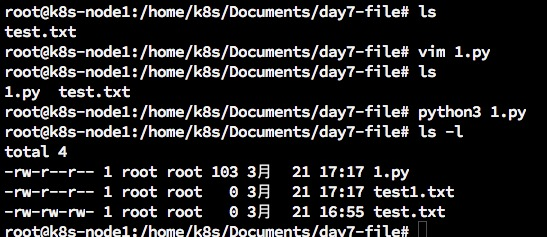
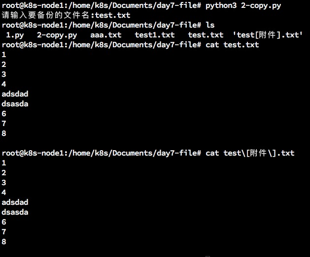
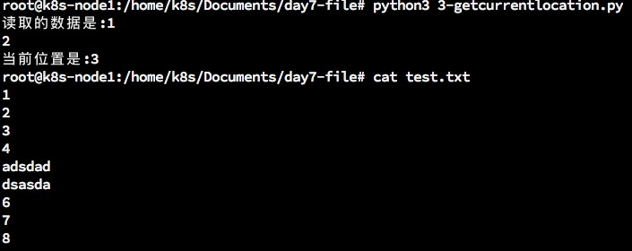
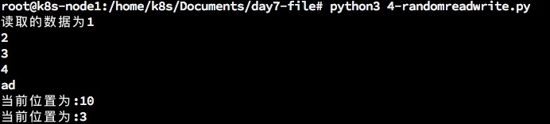
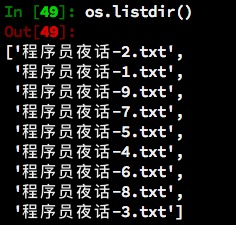
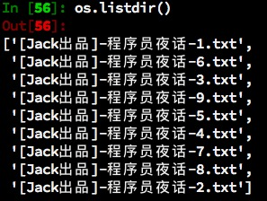

## day7-文件
***
### 7.1 文件操作介绍


### 7.2 文件的打开和关闭
#### <1>打开文件
在python中，使用open函数，可以打开一个已经存在的文件，或者创建一个新文件   
```
open(文件名，访问模式)   
```   
示例如下   ：
```
    f = open('test.txt','w')
```   
说明：   
| 访问模式 | 说明 |
| :----|:----|
| r| 以只读方式打开文件。文件的指针将会放在文件的开头。这是默认的模式。|
| w|打开一个文件只用于写入。如果该文件已存在则将其覆盖。如果该文件不存在，创建新文件。 |
| a| 打开一个文件用于追加。如果该文件已存在，文件指针将会放在文件的结尾。也就是说，新的内容将会被写入到已有内容之后。如果该文件不存在，创建新文件进行写入。|
| rb| 以二进制格式打开一个文件用于只读。文件指针将会放在文件的开头。这是默认模式。|
| wb| 以二进制格式打开一个文件只用于写入。如果该文件已存在则将其覆盖。如果该文件不存在，创建新文件。|
| ab| 以二进制格式打开一个文件用于追加。如果该文件已存在，文件指针将会放在文件的结尾。也就是说，新的内容将会被写入到已有内容之后。如果该文件不存在，创建新文件进行写入。|
| r+| 打开一个文件用于读写。文件指针将会放在文件的开头。|
| w+| 打开一个文件用于读写。如果该文件存在则将其覆盖。如果该文件不存在，创建新文件。|
| a+| 打开一个文件用于读写。如果该文件已存在，文件指针将会放在文件的结尾。文件打开时会是追加模式。如果该文件不存在，创建新文件用于读写。 |
| rb+| 以二进制格式打开一个文件用于读写。文件指针将会放在文件的开头。|
| wb+| 以二进制格式打开一个文件用于读写。如果该文件已存在则将其覆盖。如果该文件不存在，创建新文件。 |
| ab+| 以二进制格式打开一个文件用于追加。如果该文件已存在，文件指针将会放在文件的结尾。如果该文件不存在，创建新文件用于读写。|

#### <2>关闭文件
```
    close()
```   
示例如下：   
```
    #新建一个文件夹，文件名为test.txt
    f = open('test1.txt','w')

    #关闭这个文件
    f.close()
```
运行结果：   
   

### 7.3 文件的读写
#### 读   
```
f = open('aaa.txt','r')  #如果你只想读r可以不写，默认就是只读
f.read(5)   #如果不加字符数，一次性就读完了，如果加了字符数，则只读相应的字符数，下次运行read()指令会从读过的地方开始。

```   

#### 写   
```
f = open('aaa.txt','w')
f.write("hello world!")
```   

#### 读数据(readlines)
就像read没有参数一样，readlines 可以按照行的方式把整个文件中的内容进行一次性读取，并且返回的是一个列表，其中每一行的数据为一个元素   
```
In [14]: f = open('aaa.txt','r')

In [15]: content = f.readlines()

In [17]: print(type(content))
<class 'list'>

In [18]: content
Out[18]: ['hello world!']

In [19]: i =1

In [20]: for temp in content:
    ...:     print("#%d:%s"%(i,temp))
    ...:     i+=1
    ...:     
#1:hello world!

In [21]: f.close()
```   

#### 读数据(readline)
和readlines一样都是读数据，但是readline每次只读一行   
```
In [1]: f = open('test.txt')

In [2]: f.readline()
Out[2]: '1\n'

In [3]: f.readline()
Out[3]: '2\n'

In [4]: f.readline()
Out[4]: '3\n'

In [5]: f.readline()
Out[5]: '4\n'

In [6]: f.readline()
```   

### 7.4 应用1:制作文件的备份
#### 任务描述
* 输入文件的名字，然后程序自动完成对文件的备份
   
```
#coding = utf-8
# 提示并获取要复制的文件名
fileNameInput = input('请输入要备份的文件名:')
fileNameList = fileNameInput.split(".",-1)
fileName = fileNameList[0]+"[附件]"+"."+fileNameList[1]


# 打开要复制的文件
origFile = open('test.txt')

# 创建一个新的文件,用来存储原文件的数据内容
destFile = open(fileName,'w')

# 复制
# 方法一
#content = origFile.read()
#destFile.write(content)
# 方法二
#for lineContent in origFile.readlines():
#    destFile.write(lineContent)
# 方法三:最保险的方式，因为以上两种如果文件过大就会crash
while True:
    lineContent = origFile.readline()
    if len(lineContent)>0:
        destFile.write(lineContent)
    else:
        break
# 关闭文件
origFile.close()
destFile.close()
```   
运行结果：   
   


### 7.5 文件的定位读写
#### <1>获取当前读写的位置
在读写文件的过程中，如果想知道当前的位置，可以使用tell()来获取   
```
#coding=utf-8
#打开一个已经存在的文件
f = open("test.txt")
str = f.read(3)
print("读取的数据是:%s"%str)

#查找当前位置
position = f.tell()
print("当前位置是:%s"%position)

```   
运行结果：   
   
   
如果要实现文件的随机读写，我们使用seek(offset,from)这个函数，(offset,from)有两个参数   
* offset:偏移量
* from:方向
  0. 表示文件的开头
  1. 表示文件的当前位置
  2. 表示文件末尾
   
demo：把位置设置为:从文件开头，偏移5个字节   
```
#coding=utf-8
# 打开已经存在的文件
f = open("test.txt")
str = f.read(10)
print("读取的数据为%s"%str)
position = f.tell()
print("当前位置为:%s"%position)

#重新设置位置
f.seek(3,0)
position = f.tell()
print("当前位置为:%s"%position)

```    
运行结果：   
   


### 7.6 文件的重命名、删除
有些时候，需要对文件进行重命名、删除等一些操作，python的os模块都有这些功能
#### <1>文件重命名
os 模块中的rename()可以完成对文件的重命名操作   
rename(需要修改的文件名，新的文件名)
```
import os 

os.rename(“齐天大圣.txt”,"齐天大圣-最终版.txt")
```   

#### <2>删除文件
os 模块中的remove()可以完成对文件的删除操作   
```
import os 

os.remove(“齐天大圣.txt”)  
```   
* 用程序删除文件不会进回收站
    

### 7.7 文件夹的相关操作
实际开发中，有时需要用程序的方式对文件夹进行一定的操作，比如创建、删除等   
就像对文件操作需要os模块一样，如果要操作文件夹，同样需要os模块   

   
#### <1>创建文件夹
```
    import os

    os.mkdir("abc")
```   
   
#### <2>获取当前目录
```
    import os
    
    os.getcwd()
```   
   
#### <3>改变默认目录
```
    import os
    
    os.chdir(../)
```   

```
In [13]: pwd
Out[13]: '/home/k8s/Documents/day7-file'

In [14]: os.chdir("../")

In [15]: pwd
Out[15]: '/home/k8s/Documents'

In [16]: os.chdir("day7-file")

In [17]: pwd
Out[17]: '/home/k8s/Documents/day7-file'
```   

#### <4>获取目录列表
```
    os.listdir("./")
```   

#### <5>删除文件夹
```
    os.rmdir("abc")
```   


### 7.8 应用2:批量修改文件名
* 运行之前
   
   
   
* 运行之后   
   
   
   
示例代码1(我自己写的)：   
```
#coding=utf-8
import os

i = 1

while i < 10:
    origName = "程序员夜话-"+str(i)+".txt"
    chName = "[Jack出品]-程序员夜话-"+str(i)+".txt"
    os.rename(origName,chName)
    i+=1
         

```

### 7.9 综合应用:学生管理系统(文件版)
```
#coding=utf-8
import os
# 打印功能提示
def printMenu():
    print("="*30)
    print("      学生管理系统V1.0")
    print("0.加载数据库信息")
    print("1.添加学生信息")
    print("2.删除学生信息")
    print("3.修改学生信息")
    print("4.查询学生信息")
    print("5.显示所有学生信息")
    print("6.保存学生信息")
    print("9.退出系统")
    print("="*30)

# 获取一个学生的信息
# 全局变量
# 定义列表
stuInfo = []

newName = ""
newSex = ""
newPhone = ""
stuDatabase = []

def getInfo():

    global newName
    global newSex
    global newPhone

    #3.1 提示并获取学生的姓名
    newName = input("请输入新学生的名字:")
    newSex = input("请输入新学生的性别:(男/女)")
    newPhone = input("请输入新学生的电话号码:")

#用来修改一个学生的信息
def modifyStuInfo():
    global stuInfo
    stuId = int(input("请输入要修改的学生的序号:"))
    # 这里就使用了函数嵌套,调用了getInfo()函数来完成学生信息的修改
    getInfo()
    
    stuInfo[stuId-1]['name'] = newName
    stuInfo[stuId-1]['sex'] = newSex
    stuInfo[stuId-1]['phone'] = newPhone


def addStuInfo():
    global newName
    global newSex
    global newPhone
    global stuInfo
    #3.1 提示并获取学生的姓名
    newName = input("请输入新学生的姓名:")
    #3.2 提示并获取学生的性别
    newSex = input("请输入新学生的性别:(男/女)")
    #3.3 提示并获取学生的手机号码
    newPhone = input("请输入新学生的电话号码:")
    
    newInfo = {}
    newInfo['name'] = newName
    newInfo['sex'] = newSex
    newInfo['phone'] = newPhone
    
    stuInfo.append(newInfo)

# 打印所有学生信息
def printStuInfo():
    printStuinfoHeader()
    i = 1
    for tempInfo in stuInfo:
        print("%d     %s     %s     %s"%(i,tempInfo['name'],tempInfo["sex"],tempInfo["phone"]))
        i += 1

# 打印学生信息列表头
def printStuinfoHeader():
    print("="*30)
    print("学生的信息如下:")
    print("="*30)
    print('序号   姓名   性别   手机号码')

# 保存学生信息到文件
def saveStuInfo():
    #打开数据库文件
    f = open("学生信息数据库.txt",'w')
    
    # 将学生信息保存到列表
    j = len(stuInfo)
    i = 0
    while i < j:
        str = stuInfo[i]['name']
        stuDatabase.append(str)
        str = stuInfo[i]['sex']
        stuDatabase.append(str)
        str = stuInfo[i]['phone']
        stuDatabase.append(str)
        i += 1
    
    # 将列表中的信息保存到文件
    for strItems in stuDatabase:
        f.write(strItems+" ")
    f.close()
    
    #打印文件保存路径
    currentWorkingDirectory = os.getcwd()
    print("学生信息数据库已保存到%s目录下"%currentWorkingDirectory)

# 获取学生信息数据库文件中的数据
def readStuDatabase():
    
    global stuInfo
    # 只读打开文件
    f = open("学生信息数据库.txt")
    # 将数据转换成字符串
    stuStr = f.read()
    # 删除字符串两端的空格
    stuStr = stuStr.strip()
    # 将字符串按照空格切片成列表
    stuTempList = stuStr.split(" ")
    stuInfo = []
    j = len(stuTempList)
    i = 0
    #循环函数给全局变量赋值
    while i<j:
        print("i:%s"%i)
        l = i%3
        if l == 0:
            stuDict = {}
            stuDict["name"] = stuTempList[i]
            stuDict["sex"] = stuTempList[i+1]
            stuDict["phone"] = stuTempList[i+2]
            stuInfo.append(stuDict)
            i+=1
        else:
            i+=1
            continue
    f.close()
    # 打印加载的数据库信息
    printStuInfo()
    
def main():
        
    while True:
        #1. 打印功能提示
        printMenu()

        #2. 获取功能选项
        key = input("请输入功能序号:")


        #3.根据用户的选择,进行相应的操作
        if key == "1":
            #添加学生信息
            addStuInfo()

        elif key == "0":
            #读取数据
            readStuDatabase()

        elif key == "2":
            global stuInfo
            #2.0 删除学生信息
            #2.1 提示并获取需要修改的学生序号
            stuId = int(input("请输入要修改的学生序号:"))
            del stuInfo[stuId - 1]         

        elif key == "3":
            #修改学生信息
            #3.1 提示并获取需要修改的学生序号
            modifyStuInfo()

        elif key == "4":
            #查询学生信息
            stuId = int(input("请输入要修改的学生序号:"))
            printStuinfoHeader()
            print("%d     %s     %s     %s"%(stuId,stuInfo[stuId-1]['name'],stuInfo[stuId-1]["sex"],stuInfo[stuId-1]["phone"]))

        elif key == "5":
            #显示所有学生信息
            #print(stuInfo)
            printStuInfo()

        elif key == "6":
            #保存数据到文件
            saveStuInfo()

        elif key == "9":
            #退出系统
            break
        
        else:
            print("输入错误,请重新输入.")
            continue

# 主函数
main()
```   
   

示例代码2：老师指导后得知有个eval()函数可以直接换格式，所以下面用这个函数优化了一下代码，省了好多行；不过我还是举得我的代码也可以，因为我的代码保存的文件数据更小   
```
#coding=utf-8
import os
# 打印功能提示
def printMenu():
    print("="*30)
    print("      学生管理系统V1.0")
    print("0.加载数据库信息")
    print("1.添加学生信息")
    print("2.删除学生信息")
    print("3.修改学生信息")
    print("4.查询学生信息")
    print("5.显示所有学生信息")
    print("6.保存学生信息")
    print("9.退出系统")
    print("="*30)

# 获取一个学生的信息
# 全局变量
# 定义列表
stuInfo = []

newName = ""
newSex = ""
newPhone = ""
stuDatabase = []

def getInfo():

    global newName
    global newSex
    global newPhone

    #3.1 提示并获取学生的姓名
    newName = input("请输入新学生的名字:")
    newSex = input("请输入新学生的性别:(男/女)")
    newPhone = input("请输入新学生的电话号码:")

#用来修改一个学生的信息
def modifyStuInfo():
    global stuInfo
    stuId = int(input("请输入要修改的学生的序号:"))
    # 这里就使用了函数嵌套,调用了getInfo()函数来完成学生信息的修改
    getInfo()
    
    stuInfo[stuId-1]['name'] = newName
    stuInfo[stuId-1]['sex'] = newSex
    stuInfo[stuId-1]['phone'] = newPhone


def addStuInfo():
    global newName
    global newSex
    global newPhone
    global stuInfo
    #3.1 提示并获取学生的姓名
    newName = input("请输入新学生的姓名:")
    #3.2 提示并获取学生的性别
    newSex = input("请输入新学生的性别:(男/女)")
    #3.3 提示并获取学生的手机号码
    newPhone = input("请输入新学生的电话号码:")
    
    newInfo = {}
    newInfo['name'] = newName
    newInfo['sex'] = newSex
    newInfo['phone'] = newPhone
    
    stuInfo.append(newInfo)

# 打印所有学生信息
def printStuInfo():
    printStuinfoHeader()
    i = 1
    for tempInfo in stuInfo:
        print("%d     %s     %s     %s"%(i,tempInfo['name'],tempInfo["sex"],tempInfo["phone"]))
        i += 1

# 打印学生信息列表头
def printStuinfoHeader():
    print("="*30)
    print("学生的信息如下:")
    print("="*30)
    print('序号   姓名   性别   手机号码')

# 保存学生信息到文件
def saveStuInfo():
    #打开数据库文件
    f = open("学生信息数据库.txt",'w')
    
    # 将学生信息保存
    content = str(stuInfo)
    f.write(content)
    f.close()
    
    #打印文件保存路径
    currentWorkingDirectory = os.getcwd()
    print("学生信息数据库已保存到%s目录下"%currentWorkingDirectory)

# 获取学生信息数据库文件中的数据
def readStuDatabase():
    
    global stuInfo
    # 只读打开文件
    f = open("学生信息数据库.txt")
    # 将数据转换成字符串
    stuStr = f.read()
    stuInfo = eval(stuStr)
    f.close()
    # 打印加载的数据库信息
    printStuInfo()
    
def main():
        
    while True:
        #1. 打印功能提示
        printMenu()

        #2. 获取功能选项
        key = input("请输入功能序号:")


        #3.根据用户的选择,进行相应的操作
        if key == "1":
            #添加学生信息
            addStuInfo()

        elif key == "0":
            #读取数据
            readStuDatabase()

        elif key == "2":
            global stuInfo
            #2.0 删除学生信息
            #2.1 提示并获取需要修改的学生序号
            stuId = int(input("请输入要修改的学生序号:"))
            del stuInfo[stuId - 1]         

        elif key == "3":
            #修改学生信息
            #3.1 提示并获取需要修改的学生序号
            modifyStuInfo()

        elif key == "4":
            #查询学生信息
            stuId = int(input("请输入要修改的学生序号:"))
            printStuinfoHeader()
            print("%d     %s     %s     %s"%(stuId,stuInfo[stuId-1]['name'],stuInfo[stuId-1]["sex"],stuInfo[stuId-1]["phone"]))

        elif key == "5":
            #显示所有学生信息
            #print(stuInfo)
            printStuInfo()

        elif key == "6":
            #保存数据到文件
            saveStuInfo()

        elif key == "9":
            #退出系统
            break
        
        else:
            print("输入错误,请重新输入.")
            continue

# 主函数
main()

```   

### 7.10


***
有兴趣一起学习的可以加我微信，大家一起交流。加我请备注“13天Python学习”
