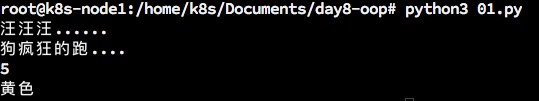

## 面向对象
***
### 想一想
如何用程序做自我介绍？   

* 面向过程:根据业务逻辑从下到上写代码
* 面向对象：对数据与函数绑定到一起，进行封装，这样能够更快速的开发程序，减少了重复代码的重复使用
   
面向过程编程最易被初学者接受，其往往用一长段代码来实现指定功能，开发过程的思路是将数据和函数按照执行的逻辑顺序组织在一起，数据与函数分开考虑。 

### 类和对象
面向对象编程的2个非常重要的概念：类和对象   
   
对象是面向对象编程的核心，在使用对象的过程中，为了将具有共同特征和行为的一组对象抽象定义，提出另外一个新的概念--类    
   
类就相当于制造飞机时的图纸，用它来进行创建的飞机就相当于对象   

#### 1.类
```
    人以物聚,类以群分.
    具有相似内部状态和运动规律的实体的集合(或统称,抽象).
    具有相同属性和行为事物的统称
```   
类是抽象的,在使用的时候通常会找到一个类的一个具体的存在,使用这个具体的存在.一个类可以找到多个对象.   

#### 2.对象
```
    某一个具体事物的存在,在现实世界中可以看得见摸得着的.
    可以直接使用的

```   
#### 3.类和对象之间的关系
小总结:类就是创建对象的模板   

#### 4.


#### 5.类的构成
类(class)有3个部分构成
* 类的名称:类名
* 类的属性:一组数据
* 类的方法:允许对进行操作的方法(行为)
   
##### <1>举例:
1) 人的类设计,只关心3样东西:
   * 事物名称(类名):人(person)
   * 属性:身高(height),年龄(age)
   * 方法(行为/功能):跑(run).打架(fight)
2) 狗类的设计
   * 类名:狗(Dog)
   * 属性:品种,毛色,性别,名字,腿儿的数量
   * 方法(行为/功能):叫,跑,咬人,吃,摇尾巴

#### 6.类的抽象
如何把日常生活中的事物抽象成程序中的类?   
拥有相同(或者类似)属性和行为的对象都可以抽象出一个类   
方法:一般名词都是类(名词提炼法)


### 定义类
定义一个类,格式如下:   
```
    class 类名:

        方法列表
```   
演示:定义一个Car类   
```
# 定义类
class Car:

    # 方法
    def getCarInfo(self):
        print('车轮子个数:%d,颜色%s'%(self.wheelNum,self.color))

    def move(self):
        print("车正在移动...")

```   
#### 说明:
* 定义类时有两种:新式类和经典类,上面的Car为经典类,如果是Car(object)则为新式类   
* 类名的命名规则一般是"大驼峰"


### 创建对象
通过上一节课程,定义了一个Car类;就好比有一张车子的图纸,那么接下来就应该把图纸交给工人们生成了    
python中,可以根据已经定义的类去创建出一个个对象   
创建对象的格式为:   
```
    对象名 = 类名()
```   

示例代码:   
```
#!/usr/bin/python3
#coding=utf-8

# 定义一个类
class Dog:
    # 定义一个方法
    def bark(self):
        print("汪汪汪......")

    def run(self):
        print("狗疯狂的跑....")

# 接下来创建一条狗
xiaogou = Dog()
# 调用小狗对象的一个方法
xiaogou.bark()
xiaogou.run()

# 添加属性
xiaogou.weight = 5
xiaogou.color = '黄色'

#获取小狗的属性
print(xiaogou.weight)
print(xiaogou.color)
```   
运行结果:   
   
   
创建对象代码演示:   
```
#coding=utf-8
# 定义类
class Car:
    
    # 移动
    def move(self):
        print('车在奔跑...')
        
    # 鸣笛
    def toot(self):
        print('车在鸣笛...嘟嘟..')
        
# 创建一个对象,并用变量BMW来保存它的引用
BMW = Car()
BMW.color = '黑色'
BMW.wheelNum = 4
BMW.move()
BMW.toot()
print(BMW.color)
print(BMW.wheelNum)
```   
运行结果:   
   
   
#### 总结:
* BMW = Car(),这样就产生了一个Car的实例对象,此时也可以通过实例对象BMW来访问属性或者方法  
* 第一次使用BMW.color = '黑色'表示给BMW这个对象添加属性,如果后面再次出现BMW.color = xxx表示对属性进行修改
* BMW是一个对象,它拥有属性(数据)和方法(函数)  
    
### __init__方法


### 应用：创建多个对象


### “魔法”方法
#### 1.打印id()
如果把xiaogou使用print进行输出的话,会看到如下信息:   
   
即看到的是创建出来的xiaogou对象在内存中的地址   
   
#### 2.定义__str__() 方法
```
   def __str__(self):
        return "hahaha...."
```   
   
   
限制只需要定义好\_\_str\_\_()就可以指定输出内容   

##### 总结
* 在python中方法名如果是__xxx__()的,那么就有特殊功能,因此叫做"魔法"方法   
* 当使用print输出对象的时候,只要自己定义了 \_\_str\_\_(self)方法,那么就会打印从这个方法中return的数据   
   
### self
#### 1.理解self
看如下示例:   
```
# 定义一个类
class Animal:
    
    # 方法
    def __init__(self,name):
        self.name = name
        
    def printName(self):
        print('名字为:%s'%self.name)
        
# 定义一个函数
def myPrint(animal):
    animal.printName()
    
    
dog1 = Animal('西西')
myPrint(dog1)
```   
运行结果:   
   

#### 总结
* 所谓self,可以理解为自己
* 可以把self当做C++中类里面的this指针一样理解,就是对象自身的意思
* 某个对象调用其方法时,python解释器会把这个对象作为第一个参数传递给self,所以开发者只要传递后面的参数即可
   
### 应用:烤地瓜
为了更好的理解面向对象编程,下面以"烤地瓜"为案例,进行分析   
   
#### 1.分析"烤地瓜"的属性和方法
##### 示例属性如下:
* cookedLevel: 这是数字;0~3表示半生不熟,超过5表示已经烤好了,超过8表示已经烤成木炭了!我们的地瓜开始时是生的
* cookedString:这是字符串;描述地瓜的生熟程度
* condiments:这是地瓜的配料列表,比如番茄酱,芥末酱等

##### 示例方法如下:
* cook():把地瓜烤一段时间
* addCondiments():给地瓜添点配料
* \_\_init\_\_():设置默认的属性
* \_\_str\_\_():让print的结果看起来更好一些
    
#### 2.定义类,并且定义 \_\_init\_\_() 方法
```
# 定义"地瓜"类
class SweetPotato:
    '这是烤地瓜的类'

    # 定义初始化方法
    def __init__(self):
        self.cookedLevel = 0
        sefl.cookedString = "生的"
        self.condiments =[]

```   

#### 3.添加"烤地瓜"方法
```
#烤地瓜的方法
    # 用火去考地瓜
    def cook(self,time):

        self.cookedLevel += time
        if self.cookedLevel > 8:
            self.cookedString = "烤糊了"
        elif self.cookedLevel > 5:
            self.cookedString = "熟了"
        elif self.cookedLevel > 3:
            self.cookedString = "半生不熟"
        else:
            self.cookedString = '生的'
```   

#### 4. 完整代码  
```
# 定义"地瓜"类
class SweetPotato:
    '这是烤地瓜的类'

    # 定义初始化方法
    def __init__(self):
        self.cookedLevel = 0
        self.cookedString = "生的"
        self.condiments =[]
    
    #定制Print打印这个对象的时候,显示的内容
    def __str__(self):
        msg = "您的地瓜已经处于" + self.cookedString + "状态 "
        if len(self.condiments)>0:
            msg += ",添加的佐料为:"
            for temp in self.condiments:
                msg += temp + ", "
        msg = msg.strip(", ")
        return msg

    # 用火去考地瓜
    def cook(self,time):
        
        self.cookedLevel += time
        if self.cookedLevel > 8:
            self.cookedString = "烤糊了"
        elif self.cookedLevel > 5:
            self.cookedString = "熟了"
        elif self.cookedLevel > 3:
            self.cookedString = "半生不熟"
        else:
            self.cookedString = '生的'
        
    #
    def addCondiments(self,temp):
        self.condiments.append(temp)

# 创建一个地瓜对象
digua = SweetPotato()

print('-'*6+'接下来开始烤'+'-'*6)
print('---------烤两分钟--------')
digua.cook(2)
print(digua)
print('---------又烤两分钟--------')
digua.cook(2)
print(digua)

print('-'*6+'添加番茄酱'+'-'*6)
digua.addCondiments("番茄酱")
print(digua)
print('-'*6+'添加芥末酱'+'-'*6)
digua.addCondiments("芥末酱")
print(digua)
print('---------又烤两分钟--------')
digua.cook(2)
print(digua)

```   
输出结果:  
   
   
### 隐藏数据
可能你已经意识到,查看或者修改对象的属性(数据),有2种方法   
#### 1.直接通过对象名修改
```
    SweetPotato.cookedLevel = 5
```   

#### 2.通过方法间接修改
```
    SweetPotato.cook(5)
```   

   
#### 分析
明明可以通过直接修改的方法,为啥还要定义方法来间接修改呢?   
   
至少有两个原因:   
* 如果直接修改属性,烤地瓜至少需要修改2部分,即修改cookedLevel和cookedString.而使用方法来修改时,只需要调用一次即可完成
* 如果直接访问属性,可能会出现一些数据设置错误的情况产生例如 cookedLevel = -3.这会使地瓜比以前还生,当然这也没有任何意义,通过使用方法来进行修改,就可以在方法中进行数据合法性的检查


### 应用:存放家具
```
#!/bin/bash/python3
#coding=utf-8
# 定义yige home 家类
class Home:

    def __init__(self,area):
        self.area = area
        self.rongNaList = []

    def __str__(self):
        msg =  "家当前可用的面积为:" + str(self.area)
        return msg

    def containItem(self, item):

        bedArea = int(item.getBedArea())

        if self.area > bedArea:
            self.rongNaList.append(item)
            self.area -= bedArea


# 定义一个bed类
class Bed:

    def __init__(self,name,area):
        self.area = area
        self.name = name

    def __str__(self):
        msg = "床占用的面积为:" + str(self.area)
        return msg

    def getBedArea(self):
        return self.area

home = Home(180)
print(home)

bed = Bed("席梦思床","4")
print(bed)

home.containItem(bed)
print(home)
```   
运行结果:  
   


***
有兴趣一起学习的可以加我微信，大家一起交流。加我请备注“13天Python学习”
