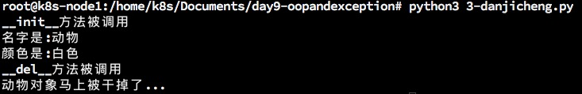
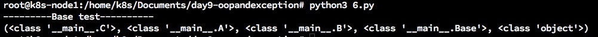
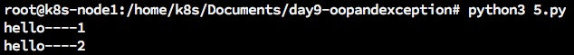
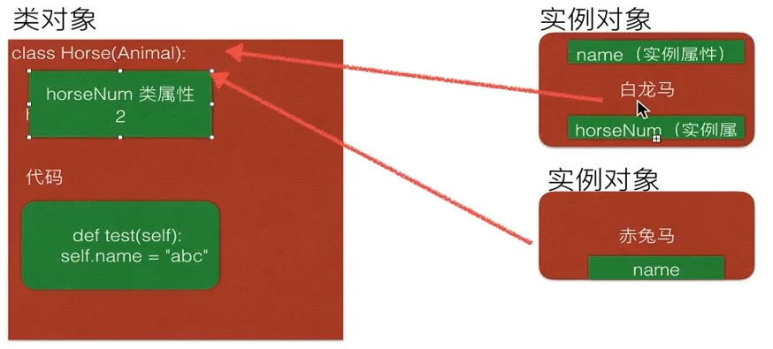

## day9-面向对象,异常处理
*** 
### 保护对象的属性
如果有一个对象,当需要对其进行修改属性的时候,2种方法:   
* 对象名.属性名 = 数据  ---->直接修改
* 对象名.方法() ---->间接修改   
    
为了更好的保存属性安全,即不能随意修改,一般的处理方法为
* 降属性定义为私有属性
* 添加一个可以调用的方法,供调用
    
```
#!/bin/bash/python3
#coding=utf-8
# 如果有(object)叫,新式类
# 原来的那种没有的,叫经典类
class People(object):

    def __init__(self, name, age):
        self.__name = name
        self.__age = age

    def __str__(self):
        return "年龄为:" + str(self.__age)

    def getName(self):
        return self.__name

    def getAge(self):
        return self.__age

    def setName(self, newName):
        if len(newName) >= 5:
            self.__name = newName
        else:
            print("error:名字长度需要大于或者等于5")

    def setNewAge(self, newAge):
        if newAge>0 and newAge<80:
            self.__age = newAge

xiaoming = People("小明",18)

xiaoming.setNewAge(119)
print(xiaoming)
ageTemp = xiaoming.getAge()
print(ageTemp)
```   
输出结果:   
```
    年龄为:18
    18  
```   

### __del__方法
创建对象后,python解释器默认调用\_\_init\_\_()方法:   
当删除一个对象时,python解释器也会默认调用一个方法,这个方法为\_\_del\_\_()方法   
```
#!/bin/bash/python3
#coding=utf-8
import time
class Animal(object):

    # 初始化的事情
    def __init__(self, name):
        print('__init__方法被调用')
        self.__name = name


    # 结束之前要做的事情
    def __del__(self):
        print("__del__方法被调用")
        print("%s对象马上被干掉了..."%self.__name)

# 创建对象
dog = Animal("哈士奇")

# 删除对象
print("------1------")

dog1 = dog
dog2 = dog

print('---------2--------')
'''
说明1:
在python中,如果有多个变量保存了同一个对象,就相当于这个对象有3个名字.
但使用del删除的时候,就相当于把一个名字删除,如果使用了多次del把所有的名字删除掉,
只要一个对象没有了名字,那么python解释器就会把这个对象从内存
中进行删除,即会按到__del__方法被调用了
'''
del dog
del dog1
del dog2

print('-------3-------')
# 虽然没有调用__del__方法,那是谁调用的呢?
# python解释器,如果检测到一个对象没有任何用处了,那么就把这个对象kill掉
```   
   
### 继承介绍以及单继承

### 1.继承的概念

### 单继承

只要是一个对象一个类来自于单个叫单继承,来自于多个叫多继承.   
```
#!/bin/bash/python3
#coding=utf-8
import time
class Animal(object):

    # 初始化的事情
    def __init__(self, name = '动物', color = '白色'):
        print('__init__方法被调用')
        self.name = name
        self.color = color

    # 结束之前要做的事情
    def __del__(self):
        print("__del__方法被调用")
        print("%s对象马上被干掉了..."%self.name)


class Dog(Animal):
    # 初始化的事情

#    def __init__(self, name = '动物', color = '白色'):
#        print('__init__方法被调用')
#        self.__name = name
#        self.__color = color

    # 结束之前要做的事情
#    def __del__(self):
#        print("__del__方法被调用")
#        print("%s对象马上被干掉了..."%self.__name)

    def printInfo(self):
        print("名字是:%s"%self.name)
        print("颜色是:%s"%self.color)

wangcai = Dog()
wangcai.printInfo()
```   
运行结果:   
   
   
#### 总结:
* 私有属性不会被继承,譬如__name以及__color;不能直接使用
* 如果通过继承的方法访问父类的私有属性是可以的
* 如果在子类中,自定义了一个方法,此方法不能访问父类中的私有属性
* 如果在方法名前面有2个下划线,那么这个方法就成了私有方法


### 多继承
```
#coding=utf-8
class Base(object):

    def test(self):
        print("---------Base test----------")

class A(Base):

    def testA(self):
        print("---------A test----------")

    def test2(self):
        print("---------A test----------")

class B(Base):

    def testB(self):
        print("---------B test----------")

    def test2(self):
        print("---------B test----------")

class C(A,B):
    pass

c = C()
#c.testA()
#c.testB()
c.test()
#可以查看C类的对象搜索方法时的先后顺序
print(C.__mro__) 
```   
   
   

* 按照"广度"进行遍历,即先遍历兄弟关系的类
    
### 重写父类方法与调用父类方法
#### 1. 重写父类方法 
所谓重写,就是子类中,有一个和父类相同名字的方法,在子类中的方法会覆盖掉父类中同名的方法   
```
#coding=utf-8
class Cat(object):
    def sayHello(self):
        print("hello----1")

class Bosi(Cat):
    # 在子类中重新编写方法,就叫做重写
    def sayHello(self):
        # 这就是调用父类的方法
        Cat.sayHello(self)  
        # super().bark()   ---> 这个也是调用父类的方法
        print("hello----2")

bosi = Bosi()

bosi.sayHello()
```   
运行结果:   
 
   
##### 说明
* python中是可以多继承的
* 父类中的方法,属性,子类会继承
     
### 多态
多态的概念是应用于Java和C#这一类强类型语言中,而Python崇尚"鸭子类型".   
所谓多态:定义时的类型和运行时的类型不一样,此时就成为多态   
* Python伪代码实现Java或C#的多态
   
```
#coding=utf-8
  
class Animal(object):
    def bark(self):
        print("啊啊啊啊啊")

class Cat(Animal):

    def bark(self):
        print("喵喵喵...")

class Dog(Animal):
    def bark(self):
        print("汪汪汪...")

# 所谓的"多态"是指,调用的方法是同一个,但是执行的代码或者说现象不一样
class Robot(object):
    def bark(self):
        print("嗡嗡嗡...")

def animalBark(temp):
    temp.bark()

maomi = Cat()
wangcai = Dog()
animalBark(maomi)
animalBark(wangcai)

dingdang = Robot()
animalBark(dingdang)
```   
运行结果:   
```
root@k8s-node1:/home/k8s/Documents/day9-oopandexception# python3 7-多态.py 
喵喵喵...
汪汪汪...
嗡嗡嗡...
```   
   
### 类属性,实例属性
在了解了类的基本概念之后,下面看一下python中的这几个概念的区别   
先来谈一下*类属性*和*实例属性*   
在前面的例子中我们接触到的就是实例属性(对象属性),顾名思义,类属性就是*类对象*所拥有的属性,它被所有*类对象*的*实例对象*所共有,在内存中只存在一个副本,这个和C++中类的静态成员变量有点类似.   
对于公有的类属性,在类外可以通过*类对象*和*实例对象*访问   
```
# 第一种用来记录马的匹数
g_horse_num = 0

class Animal(object):
    def __init__(self, name='动物', color='白色'):
        self.name = name
        self.color = color

class Horse(Animal):

    horseNum = 0  # 如果一个变量在方法外面进行定义,这样的数量叫类属性,它可以被调用 

    def __init__(self, name, color = ''):

        super().__init__(name)

        #self.horseNum = 1
        #self.horseNum += 1


bailongma = Horse("百龙马")
#g_horse_num += 1
#print(g_horse_num)
Horse.horseNum += 1
print(bailongma.name)
print(bailongma.color)
print(bailongma.horseNum)


chituma = Horse("赤兔马")
#g_horse_num += 1
#print(g_horse_num)
Horse.horseNum += 1
print(chituma.name)
print(chituma.color)
print(chituma.horseNum)
```   

##### 总结
* 赤兔马和白龙马叫实例对象
* class Horse(xxx)叫做类对象


#### 类属性
```
class People(object):
    name = 'Tom' #公有的类属性
    __age = 12  #私有的类属性

p = People()

print(p.name)           #正确
print(People.name)      #正确
print(p.__age)          #错误,不能在类外通过实例对象访问私有的类属性
print(People.age)       #错误,不能在类外通过类对象访问私有的类属性

```   
   
#### 实例属性(对象属性)
```
class People(object):
    address = "山东"    #类属性
    # 实例方法
    def __init__(self):
        self.name = 'xiaowang'  #实例属性
        self.age = 20       #实例属性
        
    # 类方法
    @classmethod
    def setNewAddress(cls):
        cls.address = '包头'

#类对象,可以直接调用类属性,也可以调用类方法
#但是类对象,不允许调用实例属性,并且也不允许调用实例方法

#如果是一个实例对象
#它可以获取实例属性和类属性的值,但是只能修改实例属性,不能修改类属性
#它还可以调用实例方法和类方法,方法前面加@classmethod就是类方法
p = People()
People.setNewAddress()
p.age = 12  #实例属性
print(p.address)    #正确
print(p.name)    #正确
print(p.age)    #正确

print(People.address)   #正确
print(People.name)   #错误
print(People.age)   #错误
```   
类属性不能通过实例属性修改,只能通过类来修改.不过这种方式不建议.建议通过类方法来修改.  
实例属性跟着实例对象走,类属性是大家共有的,类名.类方法()可以直接调用.实例对象也可以调用类方法.   
   
   


### 静态方法和类方法


### 异常介绍
#### <1>异常简介
看如下示例：   
```
print("------test---------")
open("123.txt",'r')
print("------test---------")


```  
运行结果:   
```
root@python:~/day10# python3 1.py
------test---------
Traceback (most recent call last):
  File "1.py", line 2, in <module>
    open("123.txt",'r')
FileNotFoundError: [Errno 2] No such file or directory: '123.txt'

```   
说明:   
>打开一个不存在的文件123.txt文件时，当123.txt文件不存在时。就会抛给我们一个IOerror类型的错误。
No such file or directory: 123.txt (没有123.txt这样的文件或目录)
   
异常：  
> 当Python检测到一个错误时，解释器就无法继续执行了。反而出现了一些错误的提示。这就是所谓的“异常”。   
   


### 捕获异常
#### 案例剖析
#### <1>捕获异常 try...except...
看如下示例:   
```
try:
    print("----test 1----")
    open("123.txt",'r')
    print("----test 2----")
except FileNotFoundError:
    pass

```   
运行结果:    
   
   
#### <2>捕获多个异常
```
except (FileNotFoundError,NameError):
```   

#### <3>抓取错误信息
```
try:
    print(num)
except (IOError,NameError) as errmsg:
    print("[2020-04-01 20:00:00]")
    print(errmsg)

```   
输出示例:   
  

#### <4>try...Finally
```
import time
try:
    f = file('test.txt')
    while True:
        line = f.readline()
        if len(line) == 0:
            break
        time.sleep(2)
        print(line)


finally:
    f.close()
    print('Close the file!')
```   
特性说明:  
* 不管你程序有没有出错,最终要执行的命令


说明:   
* 此程序看不到任何错误,因为用except 接受了产生FileNotFoundError错误,并添加了处理错误的方法
* pass 表示实现了相应的实现,但什么也不做;如果把pass改为print语句,那么就会输出其他信息

示例代码2:   
```
try:
    num = 100
    print(num)
except (NameError) as errmsg:
    print('产生了错误:%s'%errmsg)
else:
    print('没有捕获到异常')
finally:
    print('一定会执行')

```   
输出:   
   


### 抛出异常
你可以用raise语句来引发一个异常.异常/错误对象必须有一个名字,且它们应是error或Exception类的子类.   
下面是一个引发异常的例子:   
```
class ShortInputException(Exception):
    ''' 你定义的异常类.  '''
    def __init__(self,length,atleast):
        Exception.__init__(self)
        self.length = length
        self.atleast = atleast

try:
    s = input('请输入 -->')

    if len(s) < 3:
        # raise引发了一个你定义的异常
        raise ShortInputException(len(s),3)

except EOFError:
    print('你输入了一个结束标记EOF')
except ShortInputException as x: #x这个变量被绑定到了错误的实例
    print('ShortInputException: 输入的长度是 %d,长度至少应该是 %d'%(x.length, x.atleast))
else:
    print('没有异常发生.')

```   
输出示例:   
   

***
有兴趣一起学习的可以加我微信，大家一起交流。加我请备注“13天Python学习”
